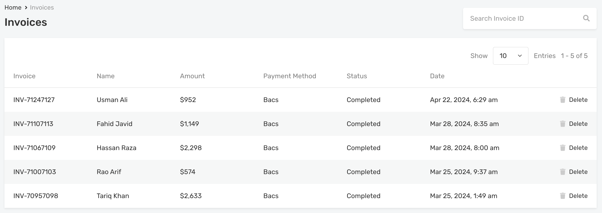

# Bookings, Reservations & Invoices

!!! info "Important"
    This module is available only if you are using the **Vacation Rentals plugin**.

To enable or disable these modules:

1. Navigate to **Dashboard → RealHomes → Customize Settings → Dashboard → Bookings & Reservations**.

   

### **Bookings**

Here's what the **Bookings** module looks like:

### **Invoices**

Here’s an overview of the **Invoices** module:

