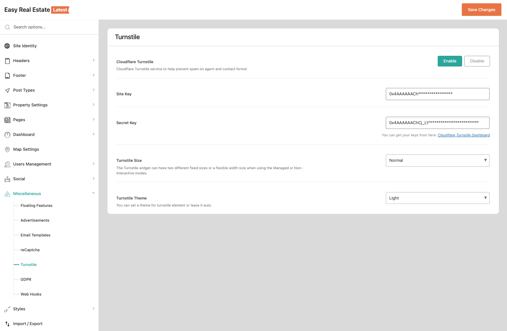

# Cloudflare Turnstile Setup

**Cloudflare Turnstile** is a privacy-friendly alternative to traditional CAPTCHAs. Once enabled in RealHomes, it helps protect your website forms from spam and bot submissions without interrupting the user experience.

---

### **Design Availability**

!!! info "Supported Designs"
    **Cloudflare Turnstile** is supported on the **Modern** and **Ultra** design variations. It is not available for the **Classic** design.

---

### **Step 1: Get Your Turnstile Keys**

Before you can enable Turnstile in RealHomes, you need to create a Turnstile widget in your Cloudflare account to obtain the **Site Key** and **Secret Key**.

1.  Go to the [**Cloudflare Turnstile Dashboard**](https://dash.cloudflare.com/?to=/:account/turnstile).
2.  Click **Add Widget** and enter your website details.
3.  Choose your preferred **Widget Mode** (Managed, Non-interactive, or Invisible).
4.  Copy the generated **Site Key** and **Secret Key**.

---

### **Step 2: Configure Turnstile in RealHomes**

To access the Turnstile settings, follow this navigation path:

!!! info "Navigation Path"
    **Dashboard** → **RealHomes** → **Settings** → **Miscellaneous** → **Turnstile** (tab)

1.  Click **Enable** to activate Turnstile protection.
2.  Paste your **Site Key** and **Secret Key** into the respective fields.
3.  Click **Save Changes** to apply the settings.

---

### **Where Turnstile Appears**

Once enabled, the Turnstile widget will automatically appear on the following forms:

*   **Login & Registration Forms** (Page and Modal)
*   **Contact Page & Agent Contact Forms**
*   **Schedule a Tour & Property Inquiry Forms**
*   **Password Reset Form**

---

### **Turnstile vs. Google reCAPTCHA**

RealHomes also supports [**Google reCAPTCHA**](google-recaptcha-setup.md). Both services provide excellent spam protection, but Turnstile offers a more privacy-focused, frictionless experience for users. 

!!! warning "Choose One Service"
    We strongly recommend using only **one** of these services at a time. If you decide to use Cloudflare Turnstile, make sure to disable Google reCAPTCHA to prevent both challenges from appearing on the same form.
