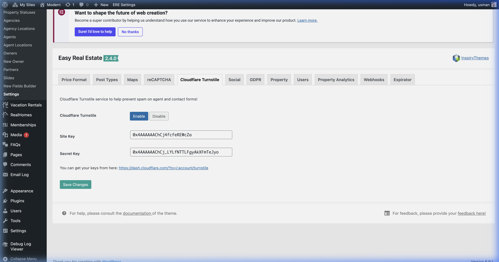

# Cloudflare Turnstile Setup

Cloudflare Turnstile is a privacy-friendly alternative to traditional CAPTCHAs. Once enabled in RealHomes, it helps protect your website forms from spam and bot submissions without interrupting the user experience.

!!! info "Design Availability"
    Cloudflare Turnstile is supported on the **Modern** and **Ultra** design variations. It is not available for the **Classic** design.

---

## Step 1: Get Your Turnstile Keys

Before you can enable Turnstile in RealHomes, you need to create a Turnstile widget in your Cloudflare account and get the **Site Key** and **Secret Key**.

1.  Go to the [**Cloudflare Turnstile Dashboard**](https://dash.cloudflare.com/?to=/:account/turnstile).
2.  Log in to your Cloudflare account (or create a free one if you don't have one).
3.  Click **Add Widget**.
4.  Enter a name for your widget (e.g., "RealHomes Website").
5.  Add your website domain(s).
6.  Choose a **Widget Mode**:
    *   **Managed** (Recommended) - Cloudflare decides when to show a challenge.
    *   **Non-interactive** - Runs in the background without user interaction.
    *   **Invisible** - Completely hidden from the user.
7.  Click **Create** to generate your keys.
8.  Copy the **Site Key** and **Secret Key** for the next step.

---

## Step 2: Configure Turnstile in RealHomes

1.  In your WordPress dashboard, navigate to **Dashboard → Easy Real Estate → Settings**.
2.  Click on the **Cloudflare Turnstile** tab.

3.  Click **Enable** to activate the Turnstile protection.
4.  Paste your **Site Key** into the Site Key field.
5.  Paste your **Secret Key** into the Secret Key field.
6.  Click **Save Changes**.

That's it! Turnstile is now active on your website.

---

## Where Turnstile Appears

Once enabled, the Cloudflare Turnstile widget will automatically appear on the following forms across your website:

| Form | Location |
|---|---|
| **Login Form** | Login page and modal popup |
| **Registration Form** | Registration page and modal popup |
| **Password Reset Form** | Modal popup |
| **Contact Page Form** | Contact page template |
| **Agent Contact Form** | Single property page (sidebar and content area) |
| **Agency Contact Form** | Single agency page |
| **Author Contact Form** | Author archive page |
| **Schedule a Tour Form** | Single property page |
| **Contact Form Over Slider** | Homepage (Modern) |

!!! note
    You do not need to add Turnstile to each form individually. Enabling it once in the settings will automatically protect all supported forms.

---

## Multilingual Support

Turnstile automatically adapts its language to match your WordPress locale. It supports over 30 languages including English, French, German, Spanish, Arabic, Hebrew, Chinese, Japanese, and more.

If your WordPress language is not directly supported by Turnstile, it will fall back to auto-detecting the visitor's browser language.

---

## Turnstile vs. Google reCAPTCHA

RealHomes also supports [Google reCAPTCHA](google-recaptcha-setup.md). You can use either option to protect your forms, but we recommend choosing one over the other to avoid conflicts.

| Feature | Cloudflare Turnstile | Google reCAPTCHA |
|---|---|---|
| Privacy-friendly | ✅ Yes | ⚠️ Uses cookies |
| Free tier | ✅ Unlimited | ✅ Limited |
| User interaction | Minimal to none | May require puzzles |
| Classic design support | ❌ No | ✅ Yes |
| Setup complexity | Simple | Moderate |

!!! warning "Choose One"
    If you are using Cloudflare Turnstile, make sure to disable Google reCAPTCHA to prevent both from appearing on the same form.
