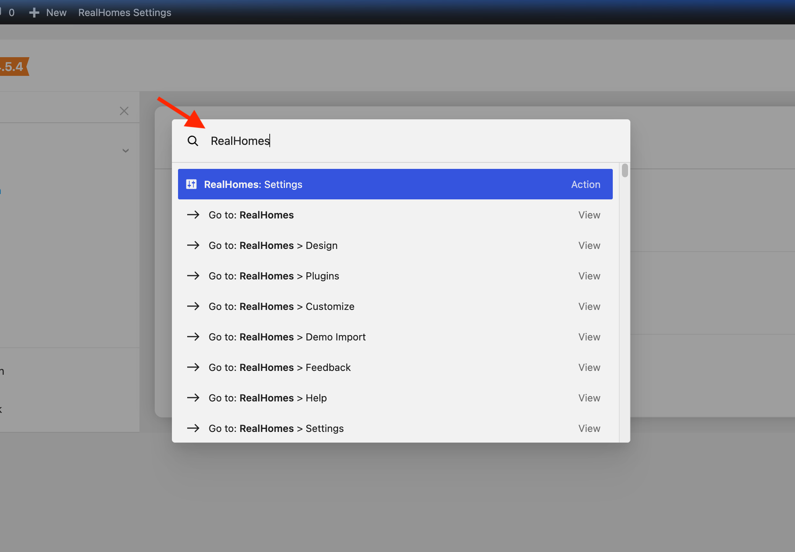
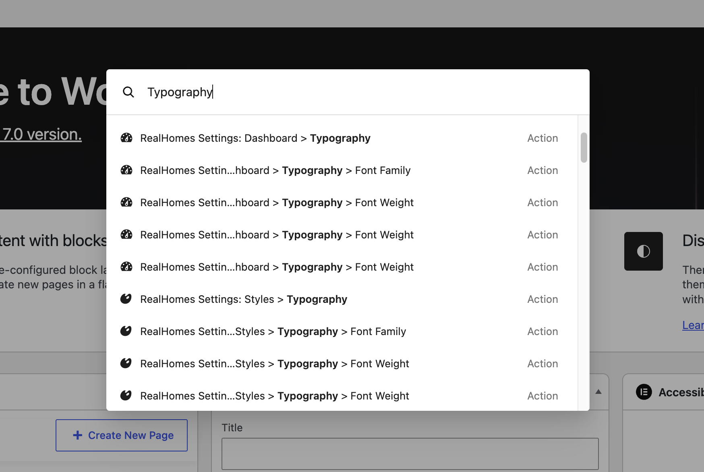
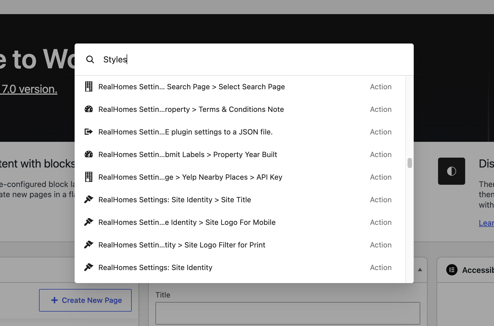
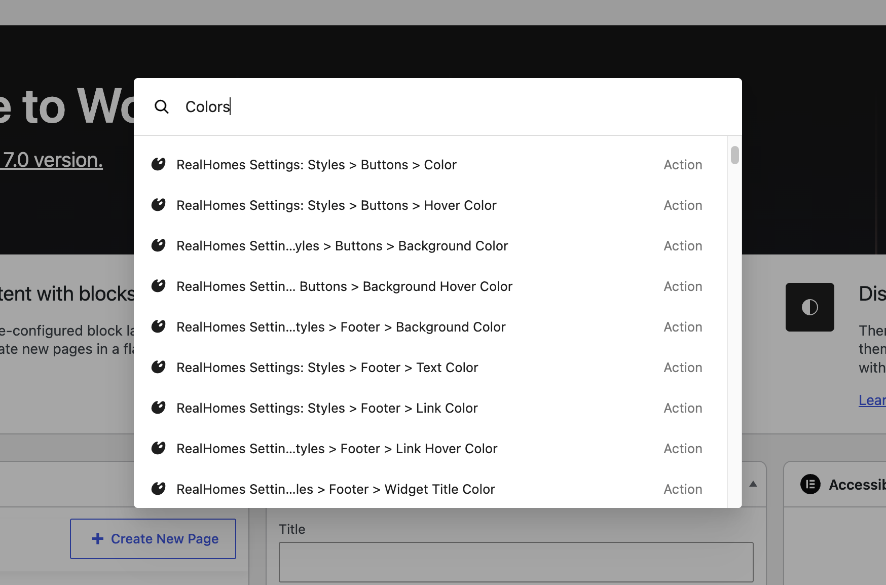
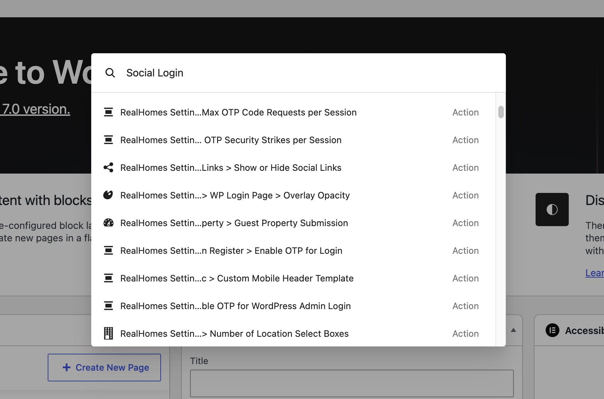
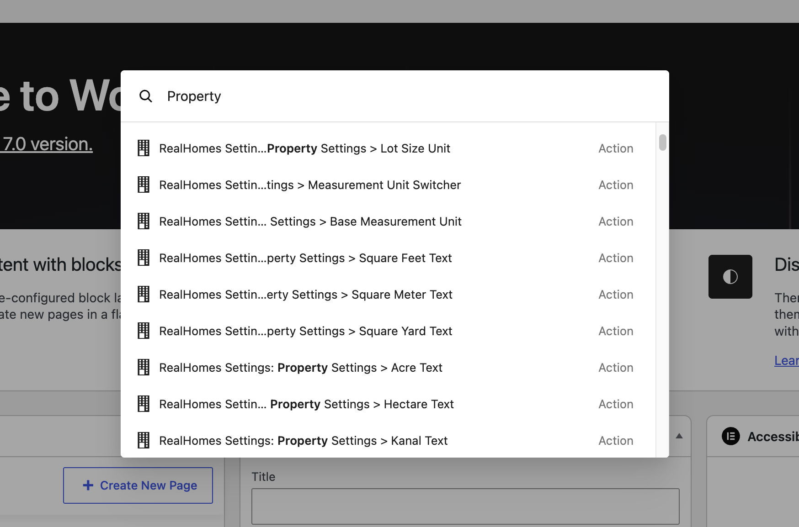

# WordPress Command Pallet Integration

As of version **4.5.4**, RealHomes settings are fully integrated into the new WordPress Command Pallet functionality (introduced in **WordPress 7.0**).

### **Why use the Command Pallet?**
Navigating through multi-level settings menus can be time-consuming, especially when looking for a specific configuration toggle. The WordPress 7.0 Command Pallet provides a powerful global search interface that solves this problem. 

By integrating RealHomes into this core WordPress feature, you no longer need to remember exact navigation paths. You can quickly search, navigate to, and access specific RealHomes settings from anywhere within the WordPress admin area in seconds (usually accessed via `CMD + K` on Mac or `CTRL + K` on Windows).

## **Usage Examples**

The Command Pallet makes it incredibly fast to jump to specific settings without hunting through menus. Here are a few examples of how you can use it with RealHomes:

- **Typography**: Type **"Typography"** into the Command Pallet, and you will see a direct link to the RealHomes Typography settings, allowing you to quickly adjust fonts and text sizes.

- **Colors / Styles**: Type **"Styles"** or **"Colors"** to instantly access the core theme design and styling options.

- **Social Login**: Type **"Social"** to jump straight into the Social Login configuration tab without clicking through multiple settings pages.

- **Property Settings**: Type **"Property"** to quickly find global settings related to how your properties are displayed and managed.

---

!!! tip "Quick Access to Everything"
    The examples above are just a starting point! **Every single setting** within the RealHomes Settings panel is indexed and accessible through the WordPress Command Pallet. If you ever forget where a specific option is located, just hit `CMD + K` (or `CTRL + K`) and type what you're looking for.
