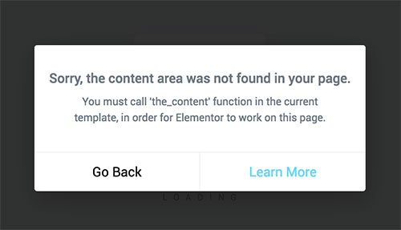

# Common Issues of Elementor

## The Content Area Was Not Found in Your Page

If this issue is occuring on the home page then navigate to **Dashboard &rarr; Real Homes &rarr; Customize Settings &rarr; Home Page &rarr; Content Area** and select **Show** for the first option.

If you face this problem on any other page then it means you are using an old version of Real Homes Theme because **Elementor support** is **added** for each template **in version 3.9.4 and later**.