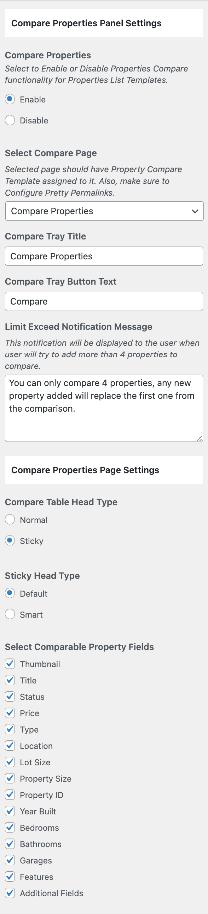
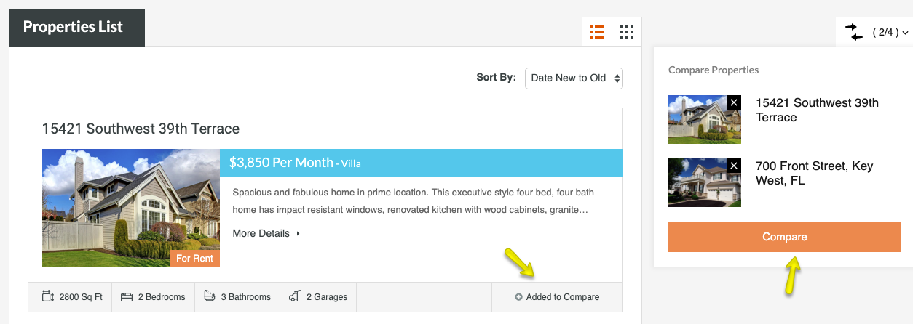
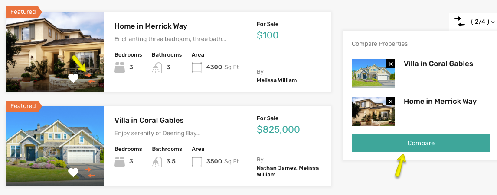

# Configure Compare Properties Settings

Navigate to **Dashboard → RealHomes → Customize Settings → Floating Features** and look for **Compare Properties** panel.

Select the **Compare Properties** page that you created in the **Select Compare Page** option. You can **Enable**/**Disable** Properties Compare functionality for **Properties List Templates** and configure other related settings here.

**Classic**

**Modern**
