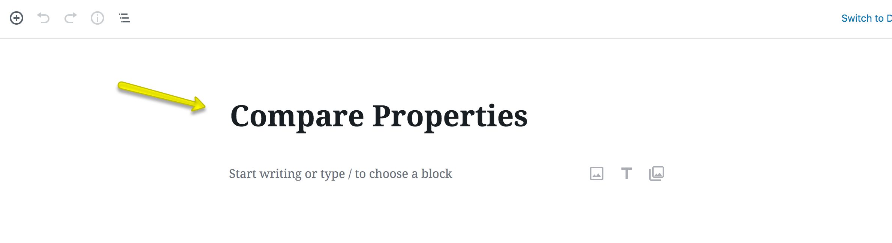
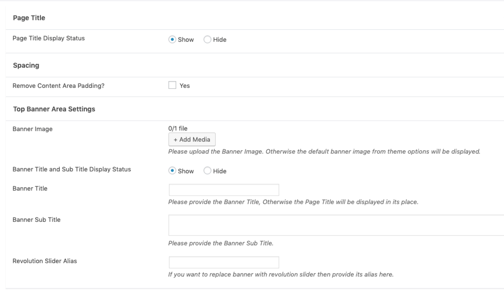

# Compare Properties Page etup

First, You need to add **Compare Properties** page. 

Go to **Dashboard → Pages → Add New** and provide page title.
 

Select the **Compare Properties** template from page attributes.

**Classic Banner and Spacing Settings**

**Modern Banner and Spacing Settings**

**Publish** the page once you are ready.

After adding the page configure **Compare Properties Settings** for the theme. **[Click here](https://realhomes.io/documentation/wpml-language-switcher/)** to learn how.