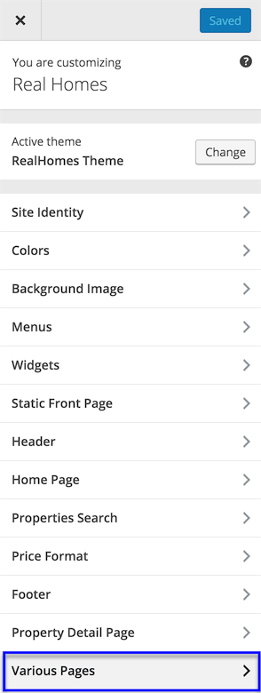
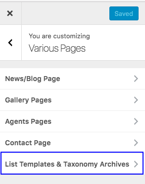

# Compare Properties Setup

First, You need to add **Compare Properties** page. 

Go to **Dashboard → Pages → Add New** and provide page title.
 

Select the **Property Compare Template** from page attributes. 

**Publish** the page once you are ready.

Now you need to navigate to **Dashboard → Appearance → Customizer** and look for Various Pages panel. 

This panel contains **List Templates & Taxonomy Archives** section where you can configure related settings.

 

Enable compare properties and select compare properties page from list of available pages.

**Save** the changes and your **Compare Properties Feature** is ready to use. 

Feel free to get in touch with us using our support website in case of any confusion.
