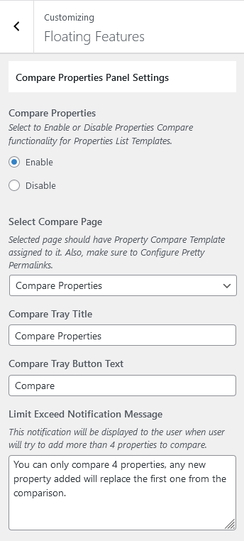
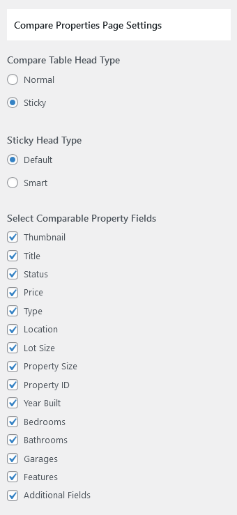

# Compare Properties Page Setup

### Create Compare Properties Page
First, You need to add **Compare Properties** page. 

Go to **Dashboard → Pages → Add New** and provide page title.
 

Select the **Compare Properties** template from page attributes.

### Compare Properties Settings

You can further setup the fields on Compare Properties in **Dashboard → RealHomes → Customize Settings → Floating Features**.

### RealHomes Misc Settings

#### **Classic**

#### **Modern**

#### **Ultra**

!!!info "More information about **Banner Settings** can be found here: "
    **https://support.inspirythemes.com/knowledgebase/how-to-configure-the-banner-settings/**

**Publish** the page once you are ready.

After adding the page configure **Compare Properties Settings** for the theme. **[Click here](/compare-properties-settings/)** to learn how.