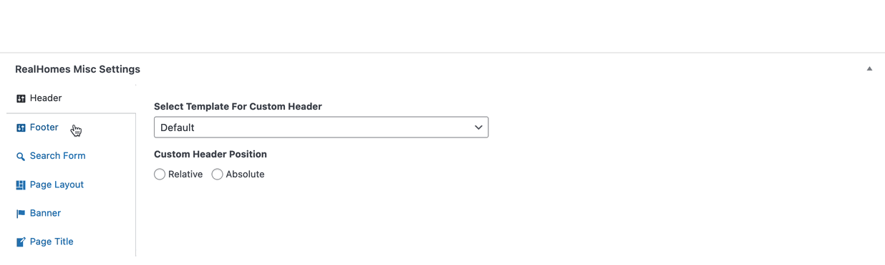

# Compare Properties Page Setup

The **Compare Properties** feature allows users to compare multiple property listings side-by-side for better decision-making. Follow the steps below to configure and customize the Compare Properties feature.

### **Create Compare Properties Page**
First, You need to add **Compare Properties** page. 

Go to **Dashboard → Pages → Add New** and provide page title.
 

Select the **Compare Properties** template from page attributes.

### **Compare Properties Settings**

#### Steps to Access Compare Properties Settings

1. Navigate to **Dashboard → RealHomes → Customize Settings → Floating Features**.
2. Locate the **Compare Properties Panel Settings** section.

---

#### **Compare Properties Panel Settings**

1. **Enable/Disable Compare Properties**  
   - Use this option to **Enable** or **Disable** the Compare Properties functionality for your property listings.  
   - Default: **Enabled**

2. **Select Compare Page**  
   - Select the page where the comparison will be displayed. Ensure that:  
     - The selected page has the **Property Compare Template** assigned.  
     - **Pretty Permalinks** are configured for smooth navigation.  

3. **Compare Tray Title**  
   - Customize the title for the floating compare tray.  
   - Example: *Compare Properties*

4. **Compare Tray Button Text**  
   - Set the text for the button that opens the compare tray.  
   - Example: *Compare*

5. **Limit Exceed Notification Message**  
   - Define the message that appears when users try to add more than **4 properties** to the comparison tray.  
   - Default Message:  
     > "You can only compare 4 properties; any new property added will replace the first one from the comparison."

---

#### **Compare Properties Page Settings**

1. **Compare Table Head Type**  
   - Choose the style for the table headers on the comparison page:  
     - **Normal**: Standard static table headers.  
     - **Sticky**: Table headers remain visible when scrolling.

2. **Sticky Head Type**  
   - If **Sticky** headers are enabled, choose the behavior:  
     - **Default**: Standard sticky headers.  
     - **Smart**: Intelligent sticky headers adjust based on content.  

---

#### **Select Comparable Property Fields**

Select which fields you want to include in the property comparison table. The following options are available:  

- [x] **Thumbnail**: Displays property images.  
- [x] **Title**: Property title.  
- [x] **Status**: Property status (e.g., For Sale, Sold).  
- [x] **Price**: Property price.  
- [x] **Type**: Property type (e.g., House, Apartment).  
- [x] **Location**: Property location.  
- [x] **Lot Size**: Land size for the property.  
- [x] **Property Size**: Total size of the property.  
- [x] **Property ID**: Unique identifier for the property.  
- [x] **Year Built**: Construction year of the property.  
- [x] **Bedrooms**: Number of bedrooms.  
- [x] **Bathrooms**: Number of bathrooms.  
- [x] **Garages**: Number of garages.  
- [x] **Features**: Additional features of the property.  
- [x] **Additional Fields**: Any extra fields configured in the theme settings.  

---

By properly configuring these options, you can provide an intuitive comparison tool to your users, enhancing their browsing experience.  

### **RealHomes Misc Settings**

#### **Classic**

#### **Modern**

#### **Ultra**

!!!info "More information about **Banner Settings** can be found here: "
    **https://support.inspirythemes.com/knowledgebase/how-to-configure-the-banner-settings/**

**Publish** the page once you are ready.

After adding the page configure **Compare Properties Settings** for the theme. **[Click here](/compare-properties-settings/)** to learn how.