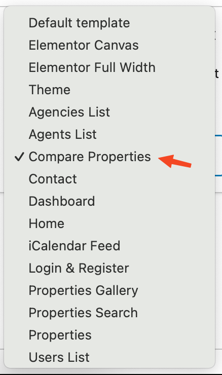
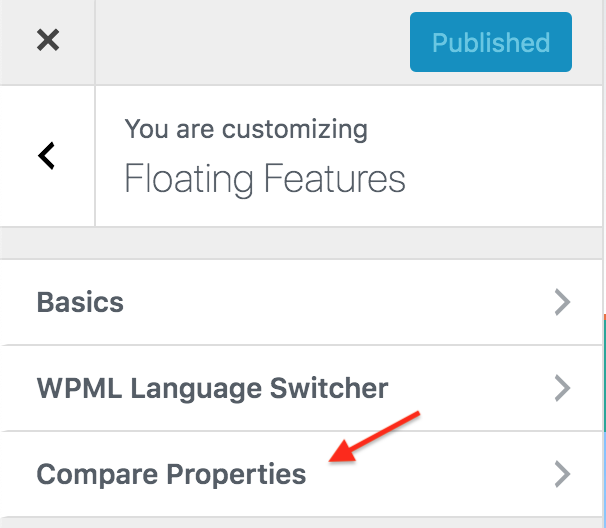

# Compare Properties Setup

First, You need to add **Compare Properties** page. 

Go to **Dashboard → Pages → Add New** and provide page title.
 

Select the **Compare Properties** template from page attributes.

**Publish** the page once you are ready.

Now you need to navigate to **Dashboard → Appearance → Customizer** and look for **Compare Properties** panel.

Select option to Enable or Disable Properties Compare functionality for Properties List Templates.

**Save** the changes and your **Compare Properties Feature** is ready to use. 

Feel free to get in touch with us using our support website in case of any confusion.
