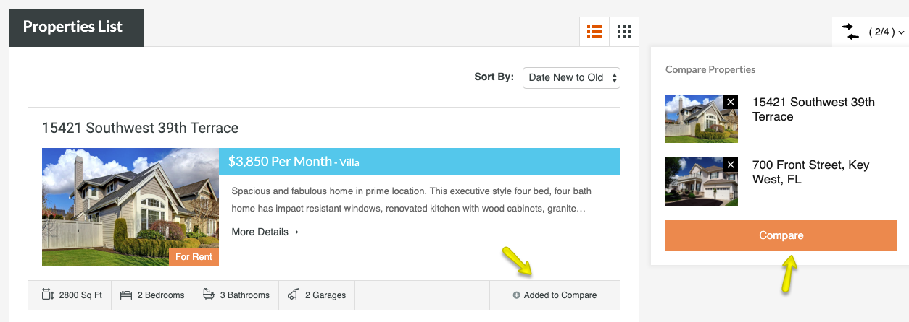
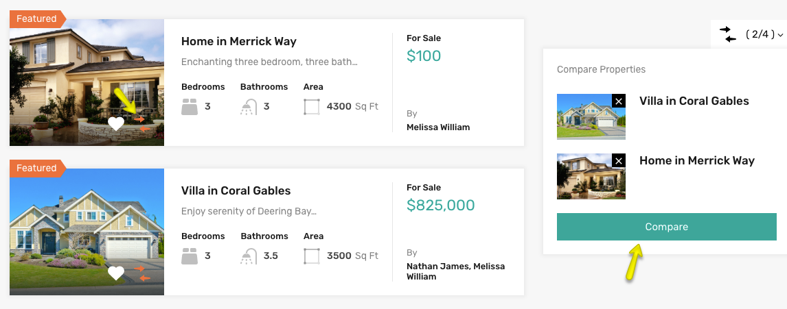

# Compare Properties Setup

First, You need to add **Compare Properties** page. 

Go to **Dashboard → Pages → Add New** and provide page title.
 

Select the **Compare Properties** template from page attributes.

**Classic Banner and Spacing Settings**

**Modern Banner and Spacing Settings**

**Publish** the page once you are ready.

Now you need to navigate to **Dashboard → Real Homes → Customize Settings → Floating Features** and look for **Compare Properties** panel.

Select the **Compare Properties** page that you created in the **Select Compare Page** option. You can **Enable**/**Disable** Properties Compare functionality for Properties List Templates and configure other related settings here.

**Classic**  

**Modern**  
