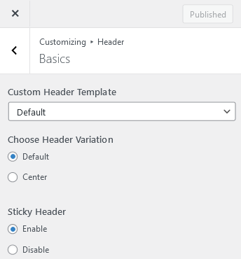
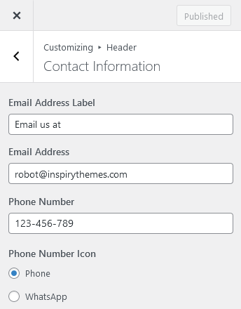
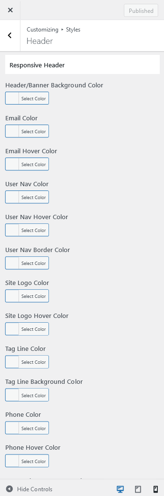

# Configure Header Settings

## **Header Panel**

Navigate to **Dashboard → RealHomes → Customize Settings** and look into **Site Identity** and Header section to explore further settings.

## **Site Identity**

You can upload your site's logo, retina logo, title, description tag and site icon from this section.

## Create Custom Header

You can create your own Custom Header using Elementor (free version) with RealHomes. You can consult <strong><a href="https://realhomes.io/documentation/custom-header-footer-elementor/">this section of the documentation</a></strong> to learn how.

## **Header Settings**

You can customize almost all the components of the header from this very section in header panel.

### **Basics**

You can change **Header Settings** in **Dashboard → RealHomes → Customize Settings → Header → Basics**.

### **Sticky Header**

The **Sticky Header** option is located in **Dashboard → RealHomes → Customize Settings → Header → Basics** (shown above).

!!! info "Important"

    If you are using Custom Elementor based Header, then <a href="https://realhomes.io/documentation/custom-header-footer-elementor/#how-to-make-elementor-header-sticky">follow the instruction here</a> to make it sticky.

### **Variations**

To change header variation please navigate to **Dashboard → RealHomes → Customize Settings → Header → Basics** and select **Center** for the option which says Choose **Header Variation**.

### **Contact Information**

You can add/modify the **Contact Information** for the header in **Dashboard → RealHomes → Customize Settings → Header → Contact Information**.

### **Search Form**

You can show or hide the Advance Search Form in the header by modifying the home page at **Page Edit** screen at the backend [ **Homepage Settings → Search Form → Properties Search Form on Homepage** ].

### **Header Styles**

To change header styles for Classic Design please navigate to **Dashboard → RealHomes → Customize Settings → Styles**.

Make sure that you have selected **My Own Custom Colors** in **Dashboard → RealHomes → Customize Settings → Styles → Default or Custom** so the style changes can work properly.

### **Responsive Header Styles**

If you would like to modify the header styles for small screens then you can go to **Dashboard → RealHomes → Customize Settings → Styles → Header** and scroll down to find **Responsive Header** styles.

