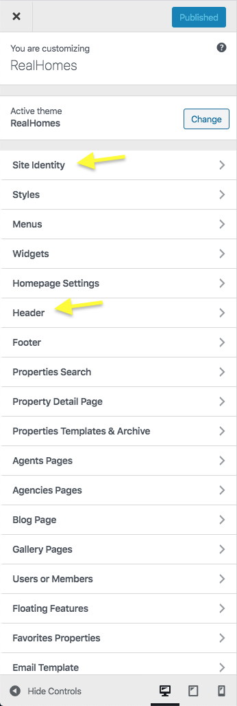
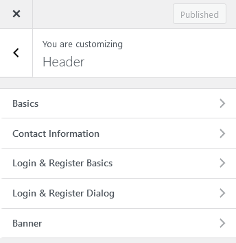
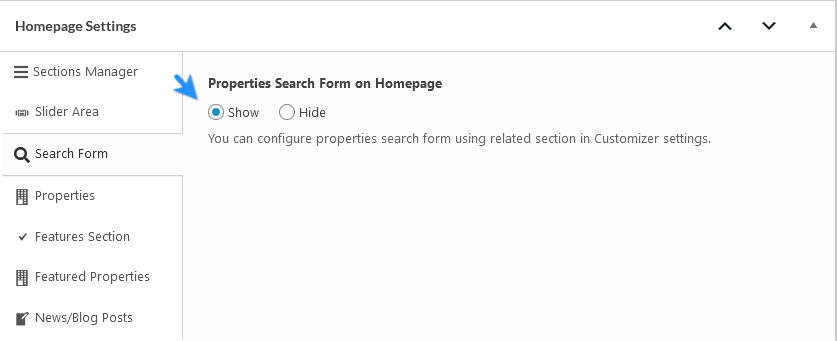
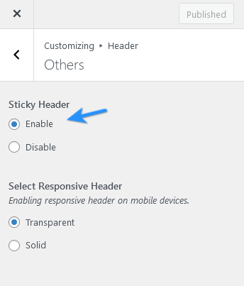
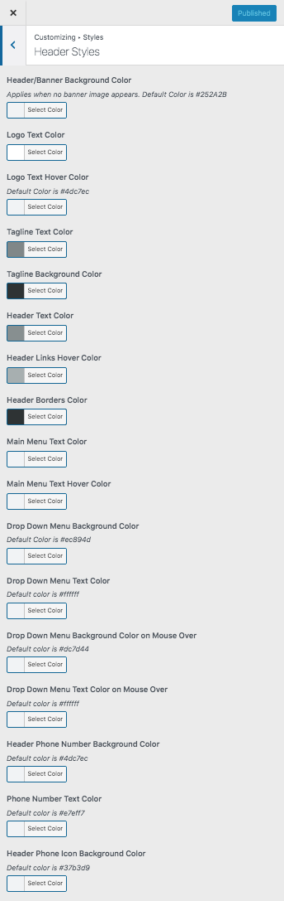

# Configure Header Settings

## **Header Panel**

Navigate to **Dashboard → Real Homes → Customize Settings** and look into **Site Identity** and Header section to explore further settings.

## **Site Identity**

You can upload your site's logo, retina logo, title, description tag and site icon from this section.

## **Header Settings**

You can customize almost all the components of the header from this very section in header panel.

### **Search Form**

You can show or hide the Advance Search Form in the header by modifying the home page at **Page Edit** screen at the backend [ **Homepage Settings → Search Form → Properties Search Form on Homepage** ].

### **Sticky Header**

The **Sticky Header** option is located in **Dashboard → Real Homes → Customize Settings → Header → Others**.

### **Variations**

To change header variation please navigate to **Dashboard → Real Homes → Customize Settings → Header → Others** and select **Center** for the option which says Choose **Header Variation**. You can also **Enable/Disable** the **Sticky Header** and select site logo filter for print in this section.

### **Styles**

To change header styles for Classic Design please navigate to **Dashboard → Real Homes → Customize Settings → Styles**.

Make sure that you have selected **My Own Custom Colors** in **Dashboard → Real Homes → Customize Settings → Styles → Default or Custom** so the style changes can work properly.

