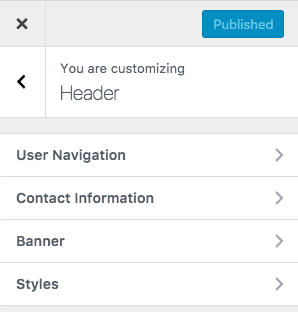

# Configure Header Settings

## Header Panel

Navigate to **Dashboard → Appearance → Customize** and look into **Site Identity** and Header section to explore further settings.

## Site Identity

You can upload your site's logo, title, description tag and site icon from this section.

## Header Settings

You can customize almost all the components of the header from this very section in header panel.

## Header Styles

To change header styles please navigate to **Dashboard → Appearance → Customize → Header → Styles** and change the style of the heading .

