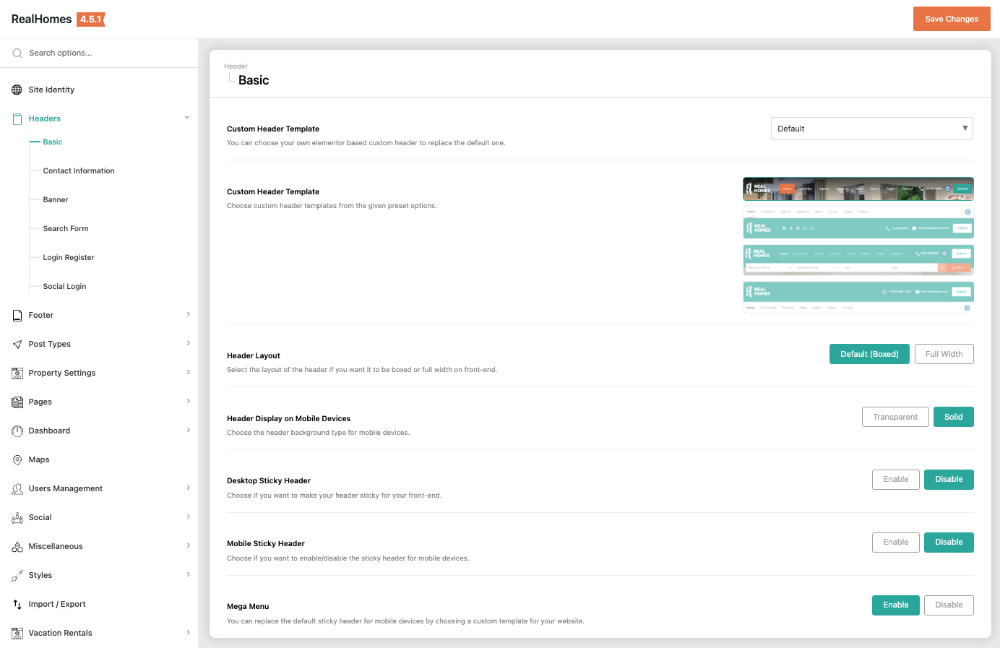
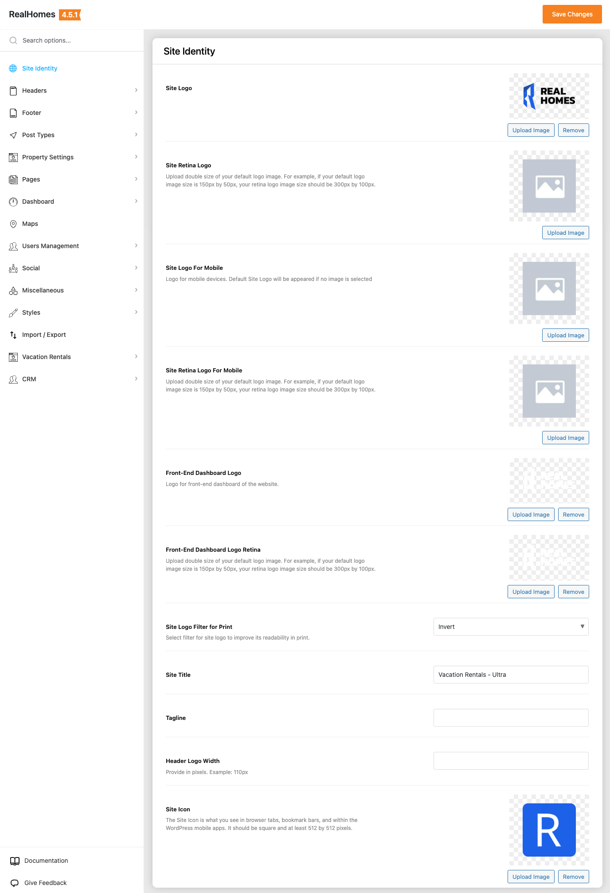
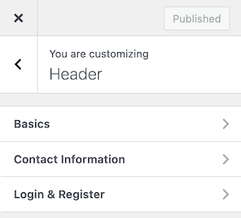
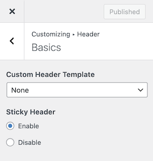
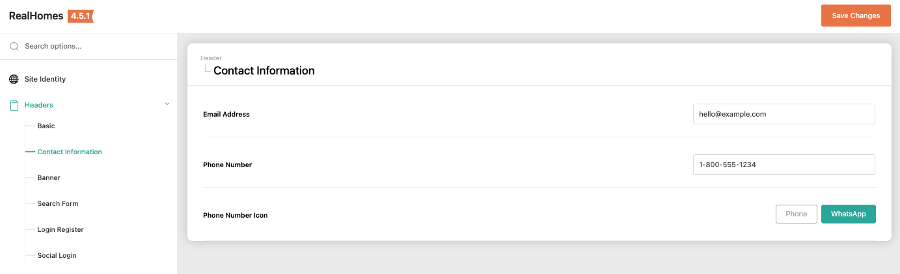
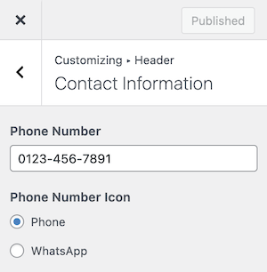
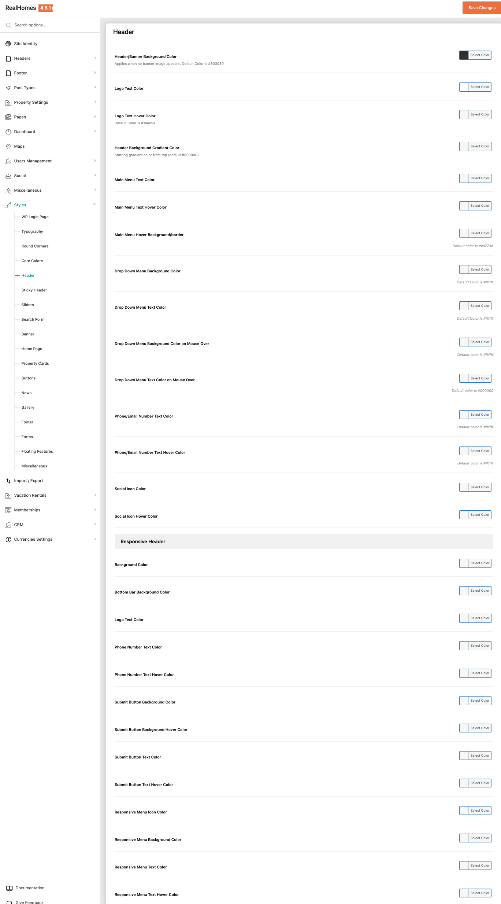
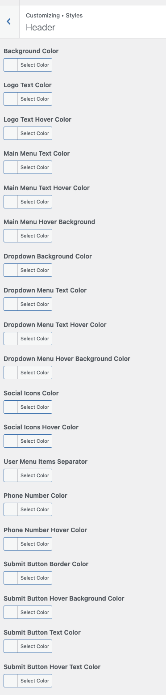
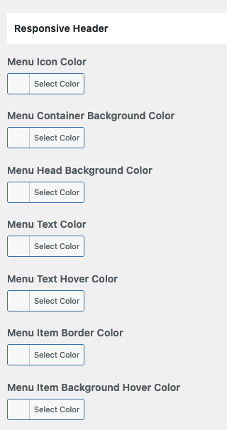
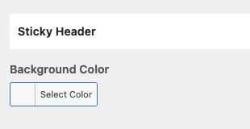

# Configure Header Settings

## **Header Panel**

To explore further settings, navigate to the following path based on your version:

=== "v4.5.1 and Later"

    !!! success "RealHomes Settings"
        Dashboard ➤ RealHomes ➤ Settings ➤ Headers

    

=== "v4.5.0 and Earlier"

    !!! info "Legacy Settings"
        Dashboard ➤ RealHomes ➤ Customize Settings

    Explore **Site Identity** and **Headers** section to explore further settings.

    

## **Site Identity**

Navigate based on your version:

=== "v4.5.1 and Later"

    !!! success "RealHomes Settings"
        Dashboard ➤ RealHomes ➤ Settings ➤ Site Identity

    

=== "v4.5.0 and Earlier"

    !!! info "Legacy Settings"
        Dashboard ➤ Customize ➤ Site Identity

    You can upload your site's logo, retina logo, title, description tag and site icon from this section.

    

## Create Custom Header

You can create your own Custom Header using Elementor (free version) with RealHomes. You can consult <strong><a href="https://realhomes.io/documentation/custom-header-footer-elementor/">this section of the documentation</a></strong> to learn how.

## **Header Settings**

You can customize almost all the components of the header from this section.

### **Basics (Header Template & Sticky Header)**

Navigate based on your version:

=== "v4.5.1 and Later"

    !!! success "RealHomes Settings"
        Dashboard ➤ RealHomes ➤ Settings ➤ Headers ➤ Basic

    

=== "v4.5.0 and Earlier"

    !!! info "Legacy Settings"
        Dashboard ➤ RealHomes ➤ Customize Settings ➤ Header ➤ Basics

    

!!! info "Important"

    If you have created your header with Elementor, follow the instructions provided in <a href="https://realhomes.io/documentation/custom-header-footer-elementor/#how-to-make-elementor-header-sticky">this guide</a> to make it sticky.

### **Contact Information**

Navigate based on your version:

=== "v4.5.1 and Later"

    !!! success "RealHomes Settings"
        Dashboard ➤ RealHomes ➤ Settings ➤ Headers ➤ Contact

    

=== "v4.5.0 and Earlier"

    !!! info "Legacy Settings"
        Dashboard ➤ RealHomes ➤ Customize Settings ➤ Header ➤ Contact Information

    

### **Header Styles**

To change header styles for Ultra Design please navigate based on your version:

=== "v4.5.1 and Later"

    !!! success "RealHomes Settings"
        Dashboard ➤ RealHomes ➤ Settings ➤ Styles ➤ Header

    

=== "v4.5.0 and Earlier"

    !!! info "Legacy Settings"
        Dashboard ➤ RealHomes ➤ Customize Settings ➤ Styles

    Make sure that you have selected **My Own Custom Colors** in **Styles → Default or Custom** so the style changes can work properly.

    

    #### **Responsive Header Styles**

    If you would like to modify the header styles for small screens then you can go to **Styles → Header** and scroll down to find **Responsive Header** styles.

    

    #### **Sticky Header Styles**

    You can modify sticky header styles by navigating to **Styles → Header** and scroll down to find **Sticky Header** styles.

    