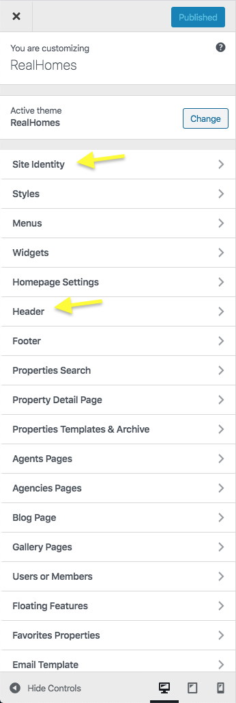
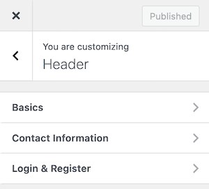
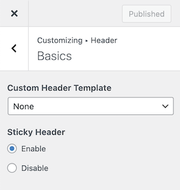
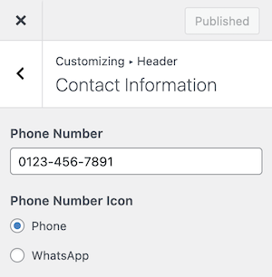
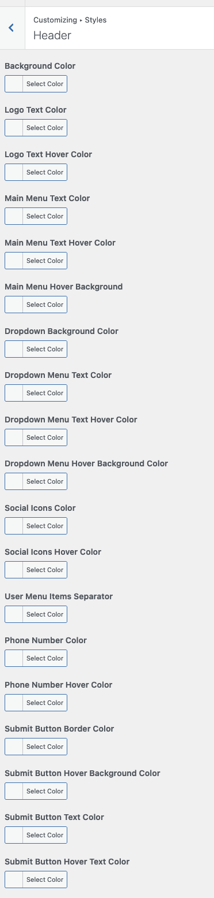
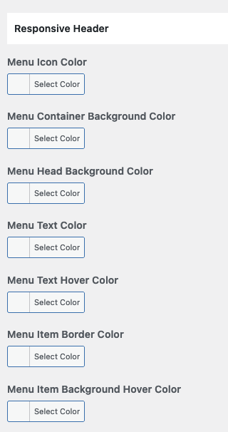
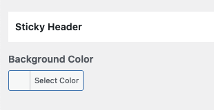

# Configure Header Settings

## **Header Panel**

Navigate to **Dashboard → RealHomes → Customize Settings** and look into **Site Identity** and Header section to explore further settings.

## **Site Identity**

You can upload your site's logo, retina logo, title, description tag and site icon from this section.

## Create Custom Header

You can create your own Custom Header using Elementor (free version) with RealHomes. You can consult <strong><a href="https://realhomes.io/documentation/custom-header-footer-elementor/">this section of the documentation</a></strong> to learn how.

## **Header Settings**

You can customize almost all the components of the header from this very section in header panel.

### **Basics (Header Template & Sticky Header)**

You can change **Header Settings** in **Dashboard → RealHomes → Customize Settings → Header → Basics**.

### **Contact Information**

You can add/modify the **Contact Information** for the header in **Dashboard → RealHomes → Customize Settings → Header → Contact Information**.

### **Header Styles**

To change header styles for Classic Design please navigate to **Dashboard → RealHomes → Customize Settings → Styles**.

Make sure that you have selected **My Own Custom Colors** in **Dashboard → RealHomes → Customize Settings → Styles → Default or Custom** so the style changes can work properly.

### **Responsive Header Styles**

If you would like to modify the header styles for small screens then you can go to **Dashboard → RealHomes → Customize Settings → Styles → Header** and scroll down to find **Responsive Header** styles.

### **Sticky Header Styles**

You can modify sticky header styles by navigating to **Dashboard → RealHomes → Customize Settings → Styles → Header** and scroll down to find **Sticky Header** styles.

