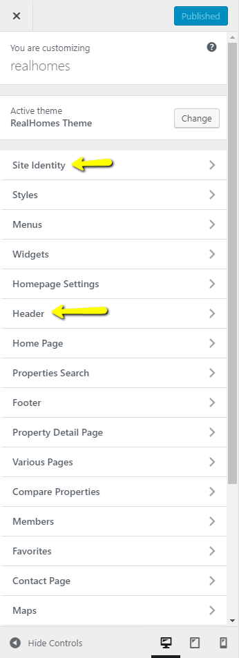
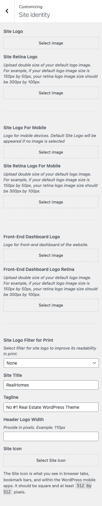
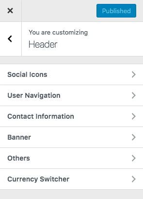
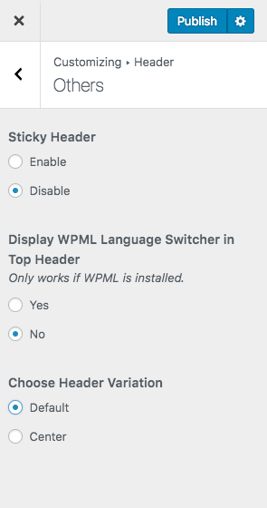
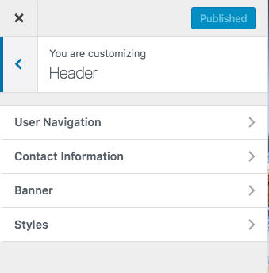
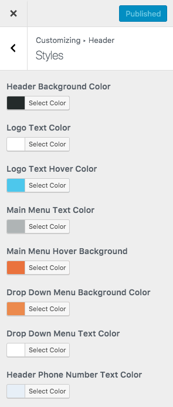

# Configure Header Settings

## Header Panel

Navigate to **Dashboard → Real Homes → Customize Settings** and look into **Site Identity** and Header section to explore further settings.

## Site Identity

You can upload your site's logo, title, description tag and site icon from this section.

## Header Settings (Classic)

You can customize almost all the components of the header from this very section in header panel.

### **Header Variation**

To change header variation please navigate to **Dashboard → Real Homes → Customize Settings → Header → Others** and select **Center** for the option which says Choose **Header Variation**. You can also **Enable/Disable** the **Sticky Header** in this section.

**Note:** **Sticky Header** & **Header Variation** options are not yet integrated into **Modern Design** layout of Real Homes Theme.

## Header Settings (Modern)

You can customize almost all the components of the header from this very section in header panel.

### **Header Styles**

To change header styles please navigate to **Dashboard → Real Homes → Customize Settings → Header → Styles**.

