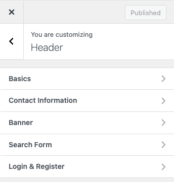
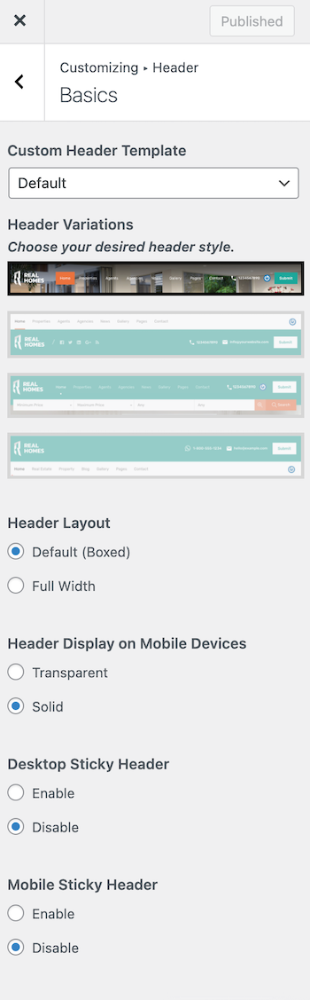
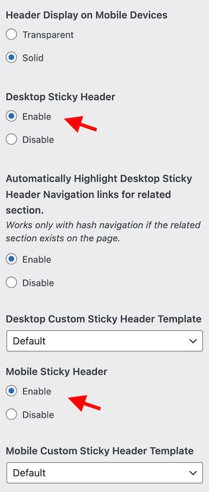
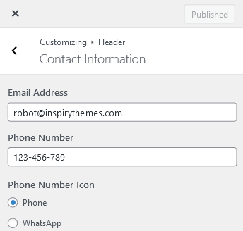
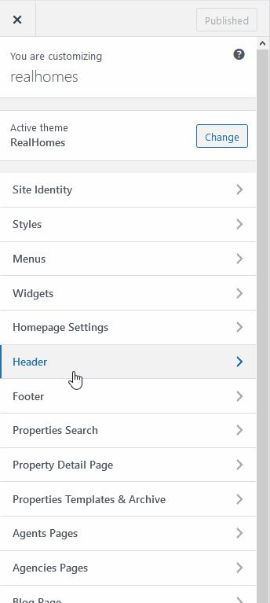
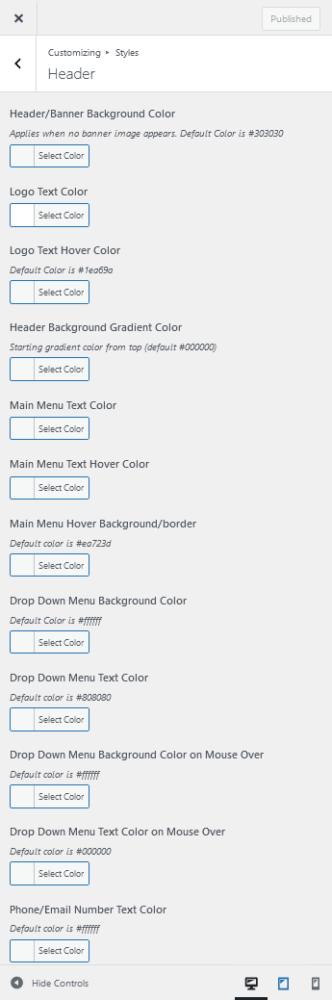
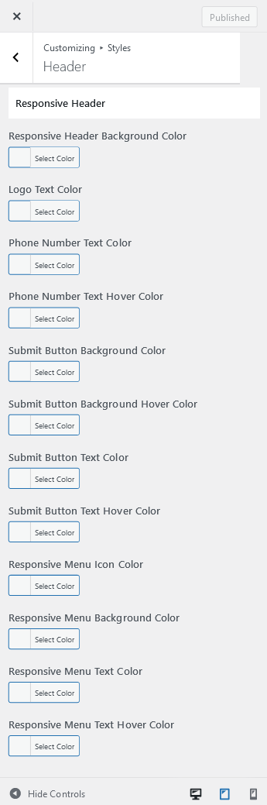

# Configure Header Settings

## **Header Panel**

Navigate to **Dashboard → RealHomes → Customize Settings** and look into **Site Identity** and Header section to explore further settings.

## **Site Identity**

You can upload your site's logo, retina logo, title, description tag and site icon from this section.

## Create Custom Header

You can create your own Custom Header using Elementor (free version) with RealHomes. You can consult <strong><a href="https://realhomes.io/documentation/custom-header-footer-elementor/">this section of the documentation</a></strong> to learn how.

## **Header Settings**

You can customize almost all the components of the header from this very section in header panel.

### **Basics**

You can change **Header Settings** in **Dashboard → RealHomes → Customize Settings → Header → Basics**.

### **Sticky Header**

The **Sticky Header** option is found in **Dashboard → RealHomes → Customize Settings → Header → Basics**. Using these settings, you can either set the standard theme headers as **Sticky Header** or you can design a header using Elementor and set it as **Sticky Header**.

!!! info "Important"

    If you have created your header with Elementor, follow the instructions provided in <a href="https://realhomes.io/documentation/custom-header-footer-elementor/#how-to-make-elementor-header-sticky">this guide</a> to make it sticky.

### **Contact Information**

You can add/modify the **Contact Information** for the header in **Dashboard → RealHomes → Customize Settings → Header → Contact Information**.

### **Search Form**

You can display or hide the Advance Search Form in the header by changing the option in **Dashboard → RealHomes → Customize Settings → Header → Search Form**.

### **Responsive Variations**

There are two Responsive Header Variations for Modern Design called **Transparent** and **Solid**. You can change the **Responsive Header Variation** in **Modern Design** by navigating to **Dashboard → RealHomes → Customize Settings → Header → Basics** (displayed above).

### **Header Styles**

To change **Header Styles**, please navigate to **Dashboard → RealHomes → Customize Settings → Styles → Header**.

### **Sticky Header Styles**

You can modify the styles of **Sticky Header** in **Dashboard → RealHomes → Customize Settings → Styles** and scroll down to find **Sticky Header** styles.

### **Responsive Header Styles**

If you would like to modify the header styles for small screens then you can go to **Dashboard → RealHomes → Customize Settings → Styles → Header** and scroll down to find **Responsive Header** styles.

