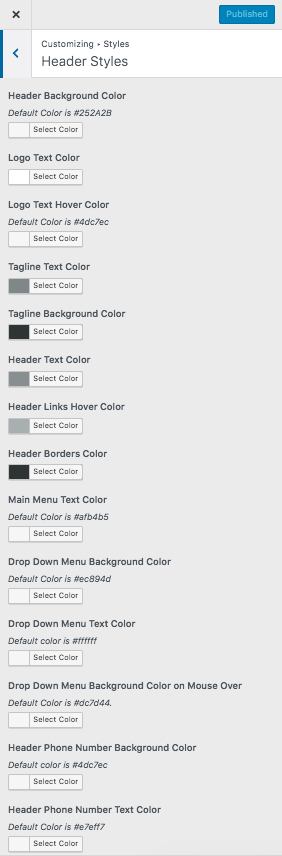
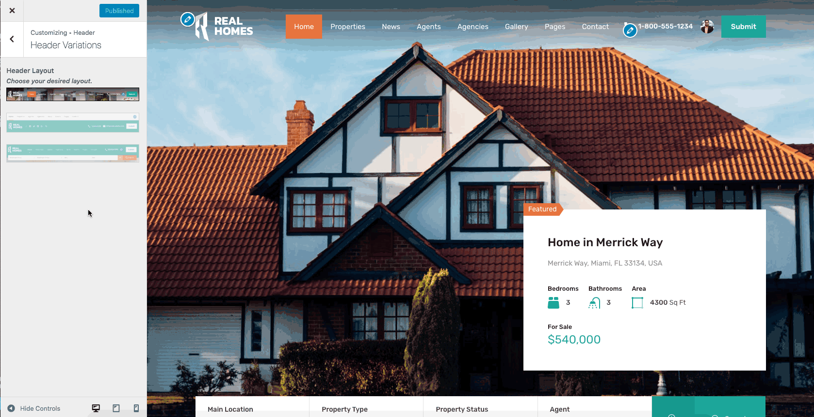

# Configure Header Settings

## **Header Panel**

Navigate to **Dashboard → Real Homes → Customize Settings** and look into **Site Identity** and Header section to explore further settings.

## **Site Identity**

You can upload your site's logo, title, description tag and site icon from this section.

## **Header (Classic)**

### **Settings**

You can customize almost all the components of the header from this very section in header panel.

### **Variations**

To change header variation please navigate to **Dashboard → Real Homes → Customize Settings → Header → Others** and select **Center** for the option which says Choose **Header Variation**. You can also **Enable/Disable** the **Sticky Header** in this section.

### **Styles**

To change header styles for Classic Design please navigate to **Dashboard → Real Homes → Customize Settings → Styles**.

## **Header (Modern)**

### **Settings**

You can customize almost all the components of the header from this very section in header panel.

### **Variations**

In Modern Design, there are multiple header variations and you can change them via **Dashboard → Real Homes → Customize Settings → Header → Header Variations** (as shown below).

### **Styles**

To change header styles for Modern Design please navigate to **Dashboard → Real Homes → Customize Settings → Styles**.

