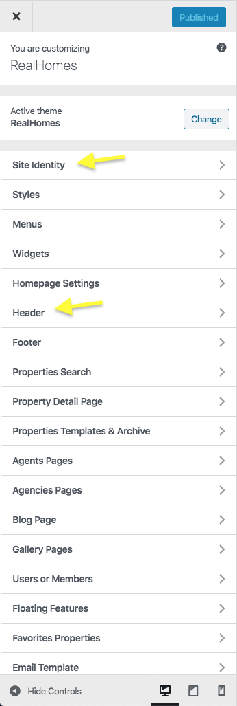
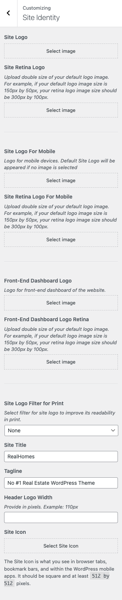
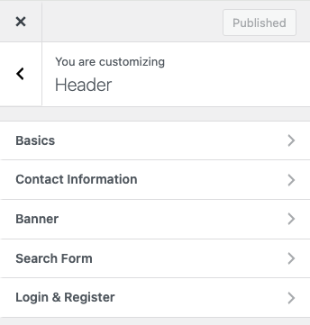
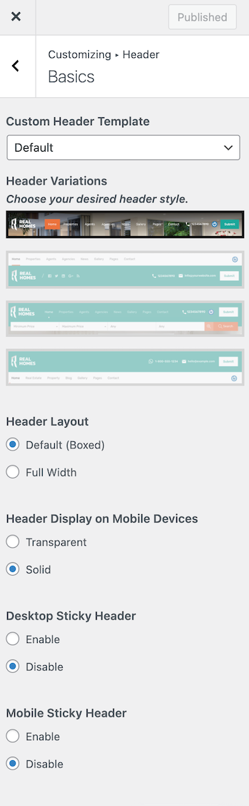
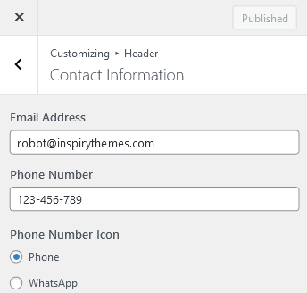
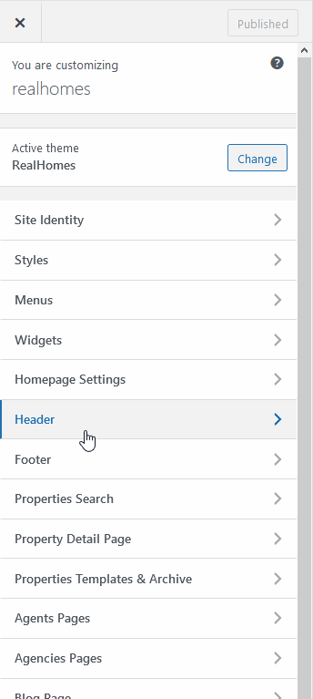
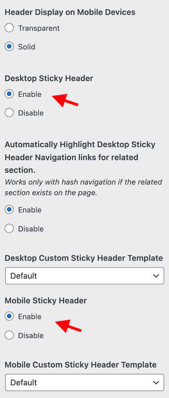
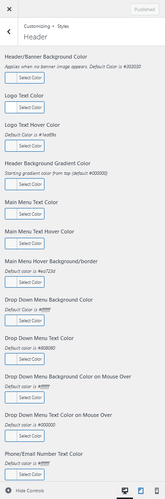
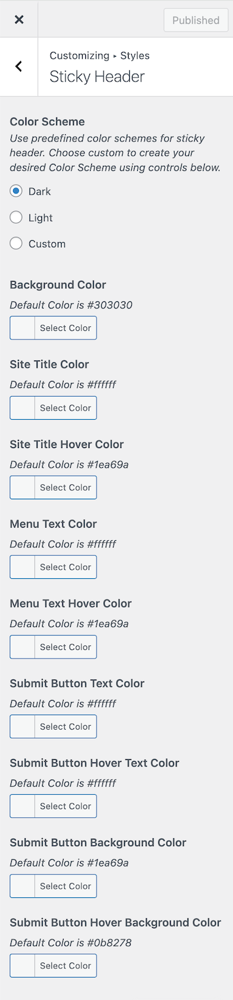
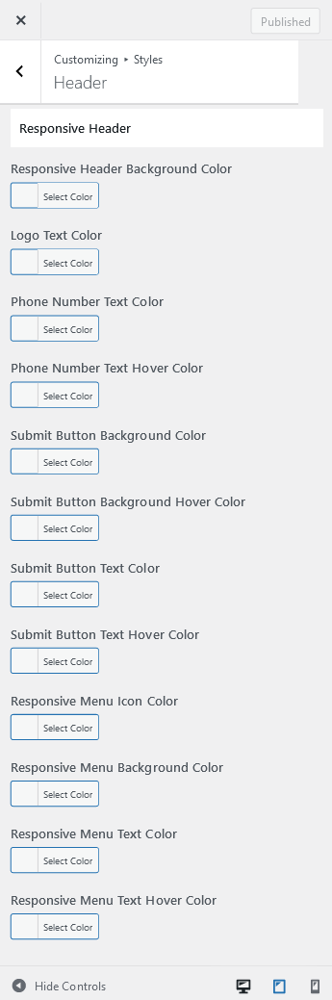

# Configure Header Settings

## **Overview**

Your website's header is the first thing visitors see. RealHomes gives you extensive control over its look and feel directly through the WordPress Customizer.

To start customizing, navigate to **Dashboard → RealHomes → Customize Settings**.

---

## **1. Site Identity (Logo & Title)**

First, let's establish your brand. Go to **Dashboard → Customize → Site Identity**.

Here you can upload:
*   **Logo:** Your main brand image.
*   **Retina Logo:** A high-resolution version (2x size) for sharp display on modern screens.
*   **Site Title & Tagline:** Text that appears if no logo is uploaded (and used for SEO).
*   **Site Icon (Favicon):** The small icon seen in browser tabs.

---

## **2. Header Customization**

Most header options are located under **Dashboard → RealHomes → Customize Settings → Header**.

### **Basics**
Located in **Header → Basics**.
Here you can control the fundamental layout and behavior of your header.

### **Contact Information**
Want to show your phone number or email right at the top?
Go to **Header → Contact Information** to add your details.

### **Search Form**
You can choose to **Show** or **Hide** the advanced search form in the header.
Go to **Header → Search Form**.

### **Sticky Header**
A sticky header stays visible at the top of the screen as users scroll down.
Toggle this feature in **Header → Basics**.

!!! info "Using Elementor?"
    If you built a custom header with Elementor, check out our guide on [**Making Elementor Headers Sticky**](https://realhomes.io/documentation/custom-header-footer-elementor/#how-to-make-elementor-header-sticky).

---

## **3. Header Styles (Colors & Layout)**

Want to change the background color, font size, or height?
Navigate to **Dashboard → RealHomes → Customize Settings → Styles → Header**.

### **Sticky Header Styles**
You can have a different look when the header is "stuck" (e.g., a white background instead of transparent).
Scroll down in the **Styles** section to find **Sticky Header** settings.

### **Responsive Header Styles**
Adjust how the header looks on mobile devices and tablets.
Scroll down further in **Styles** to find **Responsive Header** settings.

---

## **4. Advanced & Custom Headers**

### **Elementor Custom Header**
Want complete freedom? You can design a custom header from scratch using Elementor (Free version supported!).
👉 [**Learn how to create a Custom Header**](https://realhomes.io/documentation/custom-header-footer-elementor/)

### **Responsive Variations (Modern Design)**
If you are using the **Modern** design, you can switch between **Transparent** and **Solid** layouts for mobile devices.
Check **Header → Basics** to find the **Responsive Header Variation** setting.