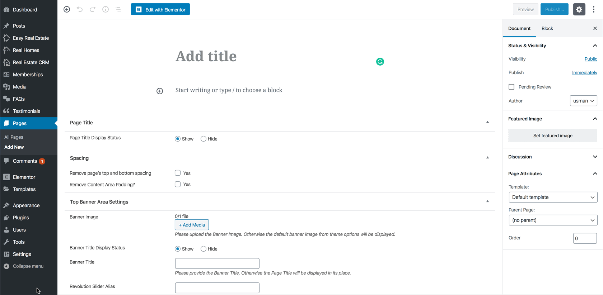
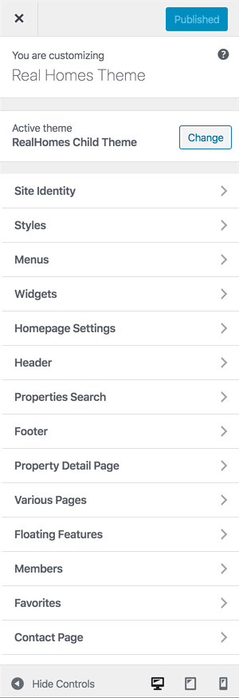

# Create and Configure Membership Page

### **Create Membership Page**

You must create a **Membership Page** with **Member Plan** template for your users so they can subscribe to the plan of their choice.

!!!warning "Important"
    Please make sure that **the slug** for this page **must not be "membership"** because it is blocked by default in WordPress.

### **Configure Membership Page in Customizer**

Navigate to **Dashboard → Real Homes → Customize Settings → Members → Basic** and select the page you just created for **Membership Plans** from the dropdown list.

