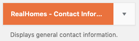
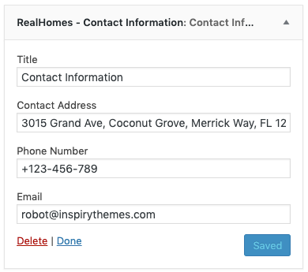
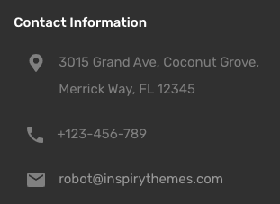

# Contact Information Widget

!!! info "Important"
    **Contact Information** widget is only available in the **Modern** design variation.

- Go to **Dashboard → Appearance → Widgets** and look for **RealHomes - Contact Information** widget.

- Use this widget in a sidebar and provide its title and contact information. 

Now check out the frontend of your site and you will have the **Contact Information** widget working for your site.

