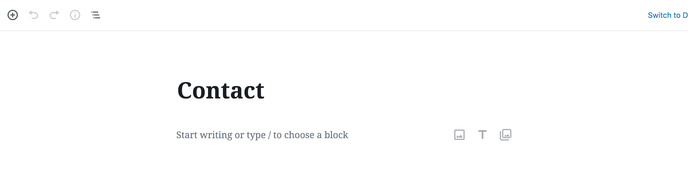
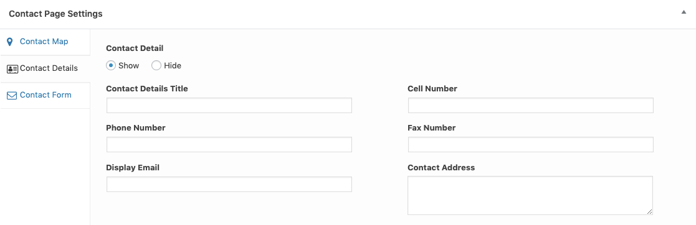
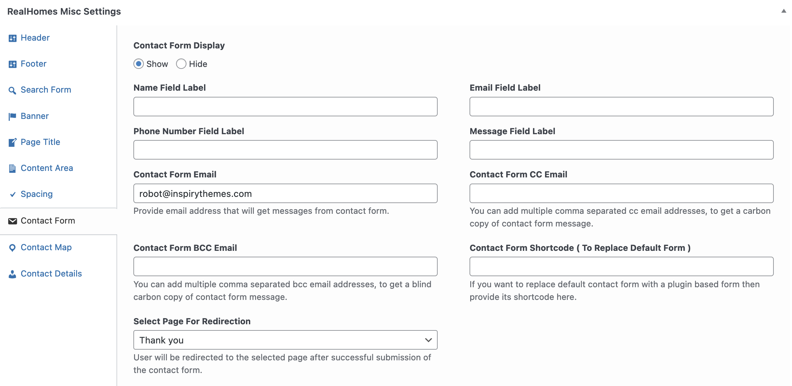
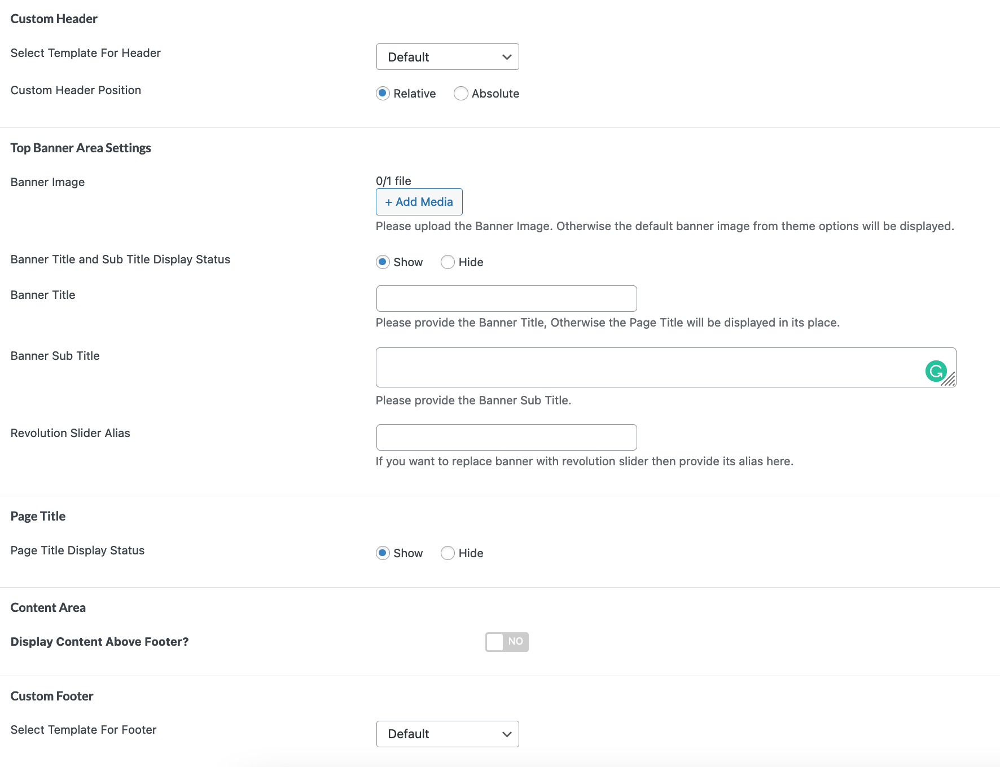
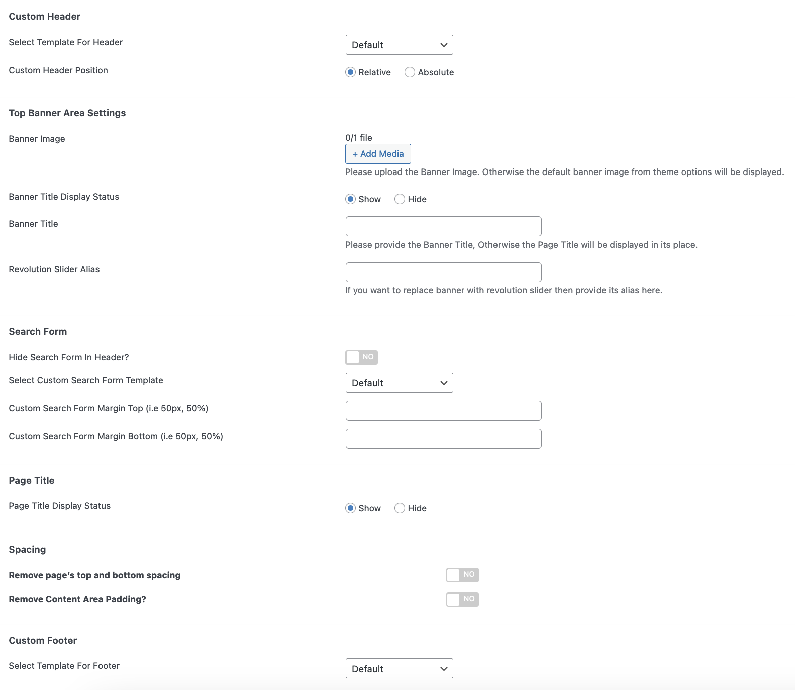
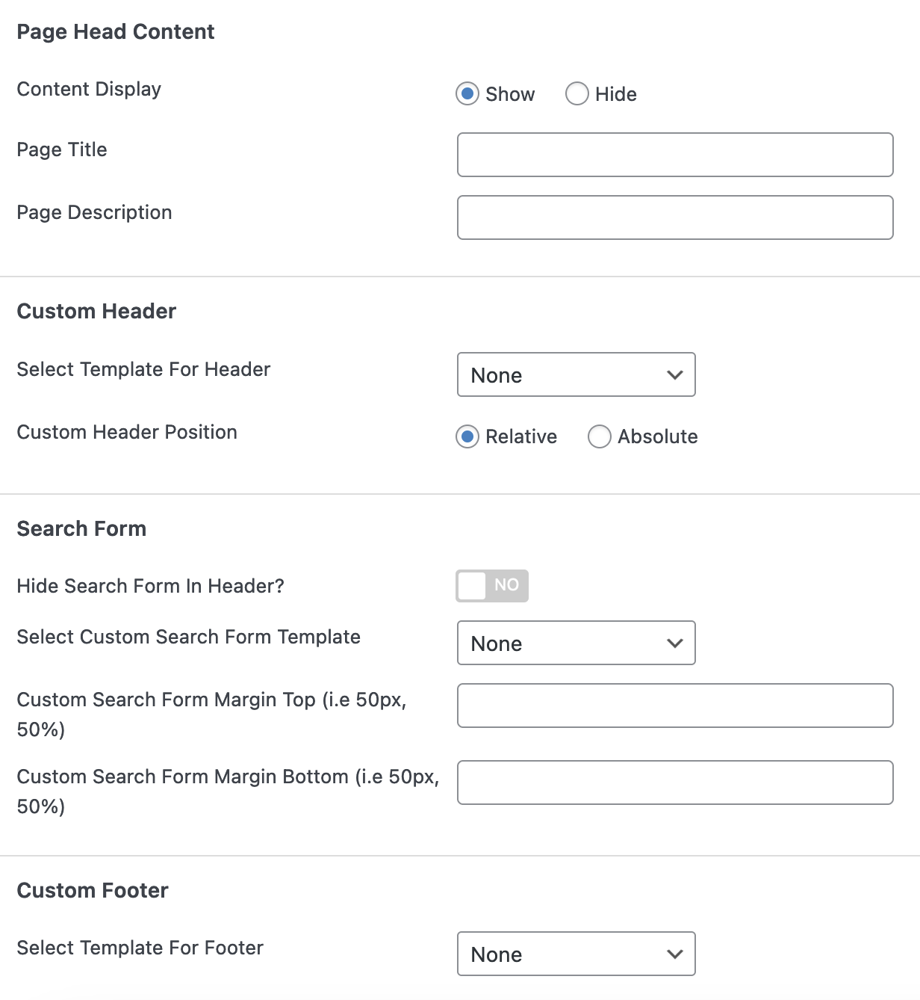
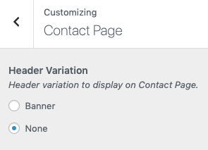

# Contact Page and Settings

## **Create Page**

!!! note
    If you have imported the demo contents XML then this page is already created.

Go to **Dashboard → Pages → Add New**

Provide the page title 

Select the **Contact** as template from page attributes.

## Contact Page Settings
Since theme version `3.9.2` you can create as many contact pages as you want and configure each contact page information from its add/edit page.

### Contact Map

!!! note
    **Map Type** option works only with Google Maps. To enable Google Maps for your website, You need to configure **Google Maps API key** by navigating to **Easy Real Estate → Settings → Maps**.

### Contact Details

### Contact Form

!!! note
    The **Contact Details Title** and **Contact Form Heading** fields are only for the **Classic** design variation.

### **Banner And Spacing Settings**

**Classic**

**Modern**

### **Ultra**

!!!info "More information about **Banner Settings** can be found here: "
    **https://support.inspirythemes.com/knowledgebase/how-to-configure-the-banner-settings/**

Publish the page once it is ready.

After publishing you need to add the newly created page in menu from **Dashboard → Appearance → Menus**. 

### **Header Variation (Modern)**

Navigate to **Dashboard → RealHomes → Customize Settings → Contact Page** section.

!!! note
    **Header Variation** option is available in **Modern** Variation only.