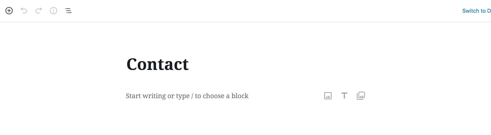
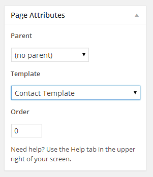
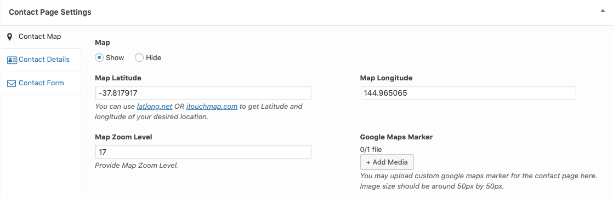
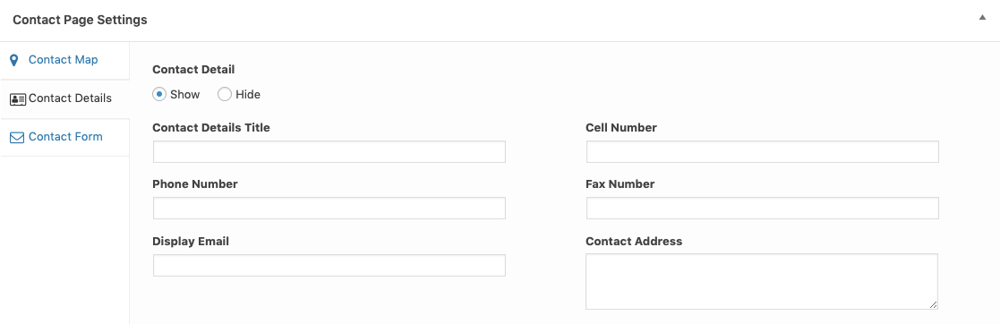
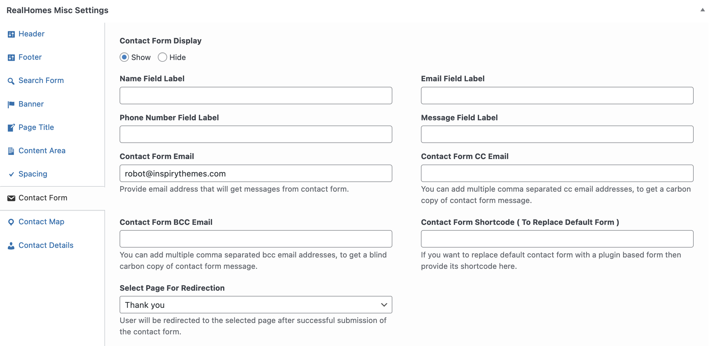
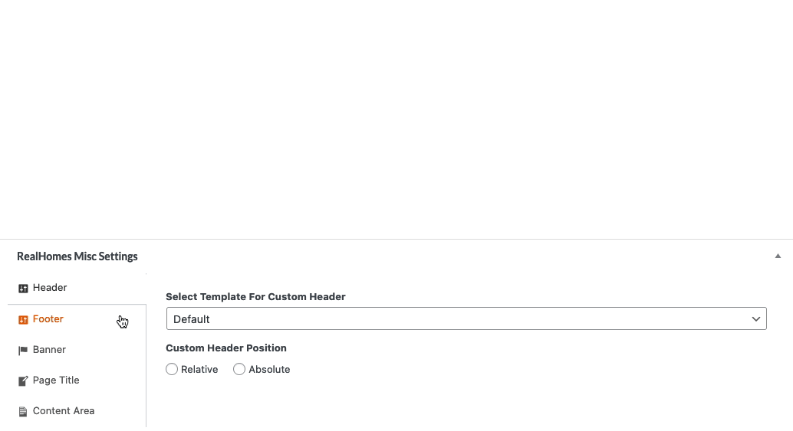
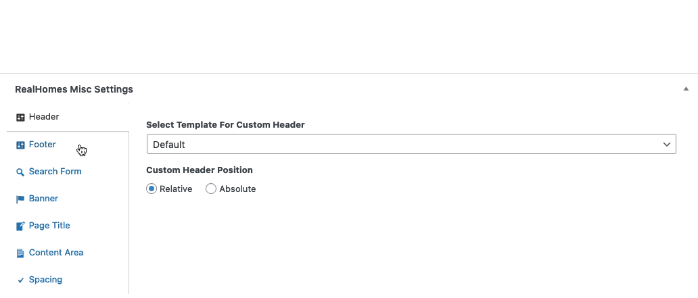
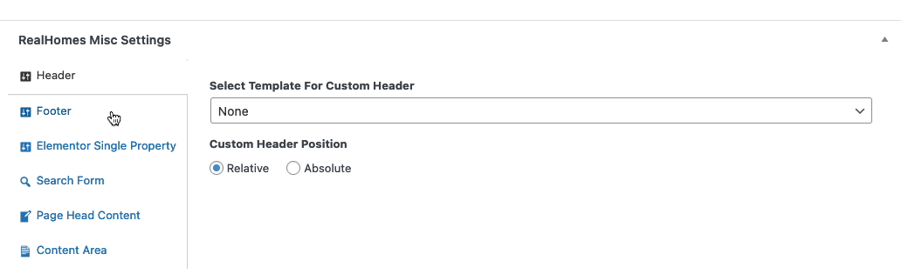
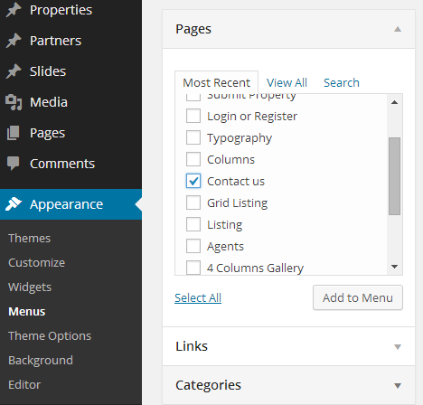
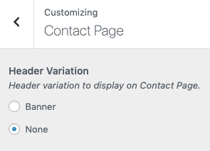

# Contact Page and Settings

## **Create Page**

!!! note
    If you imported the demo content, a Contact page has already been created for you.

To create a new one:

1.  Go to **Dashboard → Pages → Add New**.
2.  Give it a title (e.g., "Contact Us").
3.  In the **Page Attributes** section (usually on the right sidebar), select the **Contact** template.
4.  Publish the page.

---

## Contact Page Settings

You can customize the layout and content of your contact page directly from the Customizer.

### **Contact Map**

Want to show your office location? Navigate to **Dashboard → RealHomes → Customize Settings → Misc → Contact Map**.

#### **Map Visibility**
Toggle **Show** or **Hide** to display or remove the map from your contact page.

#### **Map Coordinates**
*   **Map Latitude** and **Longitude** determine the center point of your map.
*   **Tip:** Use tools like [latlong.net](https://www.latlong.net) to easily find the coordinates for your address.

#### **Map Zoom Level**
Sets how close the map is zoomed in. A value of `14` is usually perfect for showing a city view.

#### **Map Type**
Choose the visual style of the map:
*   **Roadmap** (Standard view)
*   **Satellite**
*   **Hybrid**
*   **Terrain**

!!! important "Google Maps API Key Required"
    To display Google Maps, you must have a valid API key configured.  
    Go to **Easy Real Estate → Settings → Maps** to add your key. Without it, the map will not load.

#### **Custom Map Marker**
*   **Maps Marker:** Upload your own pin icon (Recommended size: **50x50 px**).
*   **Retina Maps Marker:** Upload a high-resolution version (100x100 px) for sharp display on Retina screens.

---

### **Contact Details**

This section controls the business information displayed on your contact page.

*   **Contact Detail:** Show or hide this entire section.
*   **Contact Details Title:** The heading for your info section (e.g., "Get in Touch"). *(Classic Design only)*
*   **Phone / Cell / Fax:** Enter your contact numbers.
*   **Display Email:** The email address shown to visitors.
*   **Contact Address:** Your physical office address.

---

### **Contact Form**

Configure how the contact form works and where the emails go.

#### **Form Settings**
*   **Contact Form Display:** Show or hide the form.
*   **Field Labels:** Customize the text for Name, Phone, Email, and Message fields to match your language or tone.

#### **Email Configuration**
This is the most important part!
*   **Contact Form Email:** The email address that will **receive** the messages sent by visitors.
*   **Contact Form CC / BCC:** Add extra email addresses here (comma-separated) if you want copies sent to other team members.

#### **Advanced Options**
*   **Contact Form Shortcode:** Want to use a different form plugin (like Contact Form 7)? Paste its shortcode here to replace the default form.
*   **Select Page for Redirection:** Choose a "Thank You" page to redirect users to after they successfully send a message.

---

### **Banner Spacing (Misc Settings)**

You can adjust the spacing around the top banner of your contact page to get the perfect look.

**Classic Design**

**Modern Design**

**Ultra Design**

!!! info "Learn More"
    For detailed instructions on configuring global banner settings, check out our [**Banner Settings Guide**](https://support.inspirythemes.com/knowledgebase/how-to-configure-the-banner-settings/).

---

### **Add to Menu**

Once your page is published, don't forget to add it to your site's navigation!
Go to **Appearance → Menus** to add your new Contact page.

---

### **Header Variation (Modern Only)**

If you are using the **Modern** design, you can choose to show or hide the header banner for the contact page specifically.

Navigate to **RealHomes → Customize Settings → Contact Page**.

