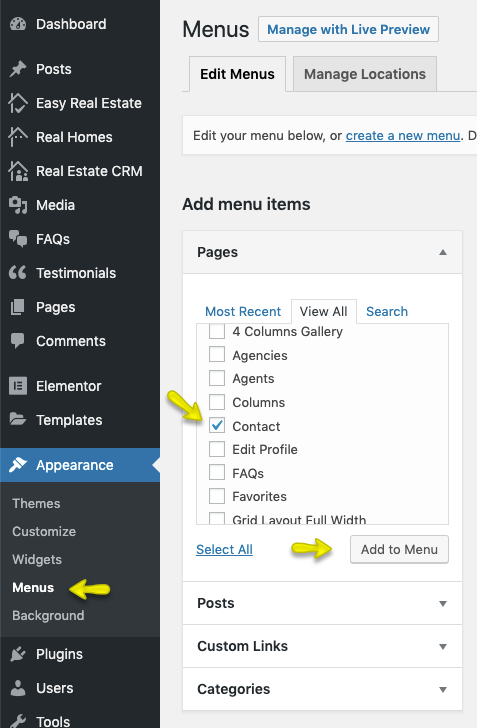

# Contact Page and Settings

## Create Page

> Note: If you have imported the demo contents XML then this page is already created.

Go to **Dashboard → Pages → Add New**

Provide the page title 

Select the **Contact** as template from page attributes.

Provide the top banner related information 

Publish the page once it is ready.

After publishing you need to add the newly created page in menu from **Dashboard → Appearance → Menus**. 

Next step is to configure **Contact Page** settings.

## Contact Settings

Navigate to **Dashboard → Appearance → Customize** and look for **Various Pages** panel, In this panel look for **Contact Page** section and explore all the available settings in this section to configure Contact page.

 

### Google Map

If you want to display google map on contact page then you need to enable it from setting displayed in below. You need to provide your location's coordinates to display it in google map. You can find your location's latitude and longitude from [itouchmap.com/latlong.html](http://itouchmap.com/latlong.html). You also need to provide the appropriate zoom level value as displayed below.

> Note: To enable Google Maps for your website, You need to configure **Google Maps API key** under **Customize → Misc** panel.

### Contact Details

Using settings displayed below, You can share any contact details that you want your site's visitors to have.

### Contact Form

Use the settings displayed below to provide **Contact Form Heading** and **Contact Form Email** to receive contact form messages. You can also add **CC** and **BCC** email addresses seprated by comma.

You can also replace the default contact form with plugin based form by adding the the shortcode in **Contact Form Shortcode** field.

