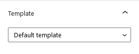

# Create News Page

In case of Demo Contents Import the news page is already created and you do not need to follow this section.

To set up the News page you need to create a new page, Go to **Dashboard → Pages → Add New**. You can give this page a title "**News**" yet you do not need to include any contents for now. Select the “**Default Template**” template from the **Page Attributes** section, as displayed in screen shot below and click “**Publish**”.

