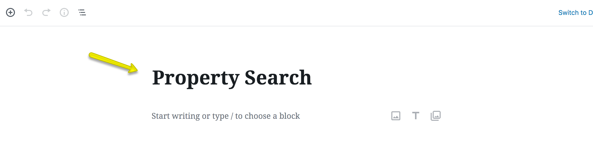
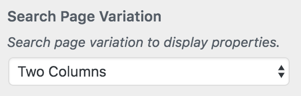

# Create Property Search Page

Create a new page "**Property Search**" Using **Property Search Template** ( In case of Imported XML this page is already created ). 
Other search templates with sidebar support are also available for use, for the same purpose.

!!! Warning
    Make sure that the slug of this page should not be "**yourwebsite.com/search/**" because that will conflict with internal WordPress search and create issues for your website.

### **Search Page Variation for Classic Design**

If you are using Classic Design and you want to change the Search Page Variation then you can navigate to **Dashboard &rarr; Appearance &rarr; Customize &rarr; Properties Search &rarr; Properties Search Page** and in the bottom of this section you have the option to choose the Search Page Variation.

### **Banner And Spacing Settings**

**Classic**

**Modern**

!!!info "More information about **Banner Settings** can be found here: "
    **https://support.inspirythemes.com/knowledgebase/how-to-configure-the-banner-settings/**