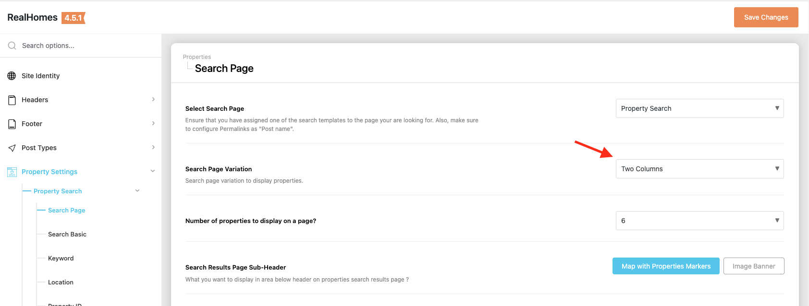
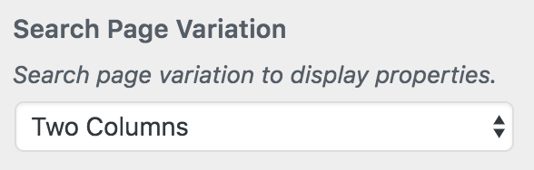

# Create Property Search Page

Create a new page "**Property Search**" Using **Property Search Template** ( In case of Imported XML this page is already created ). 
Other search templates with sidebar support are also available for use, for the same purpose.

!!! Warning
    Make sure that the slug of this page should not be "**yourwebsite.com/search/**" because that will conflict with internal WordPress search and create issues for your website.

### **Search Page Variation for Classic Design**

If you are using Classic Design and you want to change the Search Page Variation, navigate based on your version:

=== "v4.5.1 and Later"

    !!! success "RealHomes Settings"
        Dashboard ➤ RealHomes ➤ Settings ➤ Property Search ➤ Search Page

    

=== "v4.5.0 and Earlier"

    !!! info "Legacy Settings"
        Dashboard ➤ Appearance ➤ Customize ➤ Properties Search ➤ Properties Search Page

    

### **RealHomes Misc Settings**

**Classic**

**Modern**

### **Ultra**

!!!info "More information about **Banner Settings** can be found here: "
    **https://support.inspirythemes.com/knowledgebase/how-to-configure-the-banner-settings/**