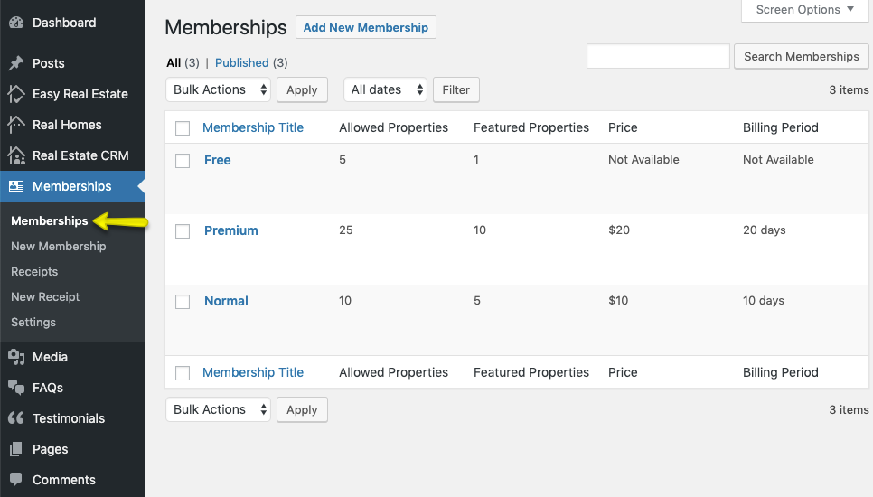
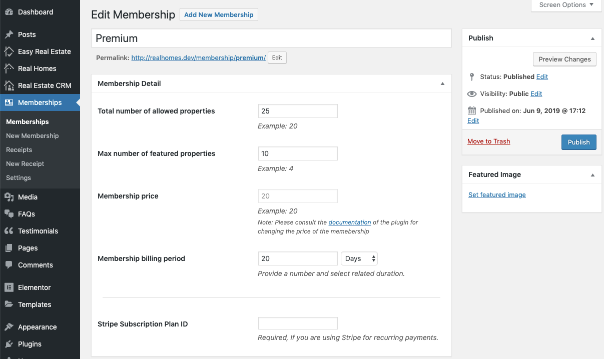
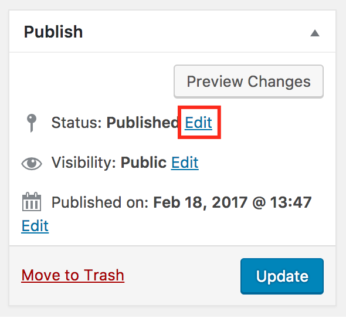
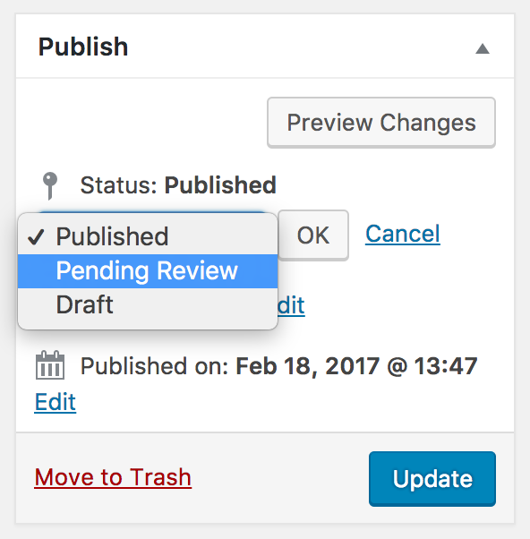
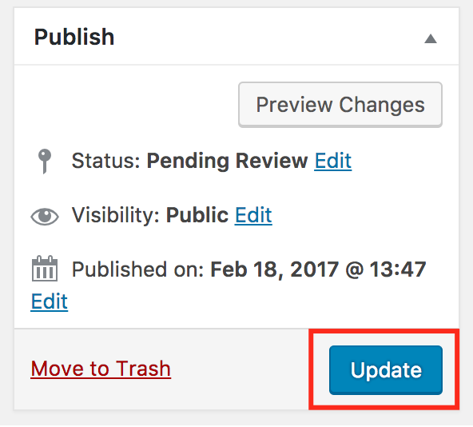
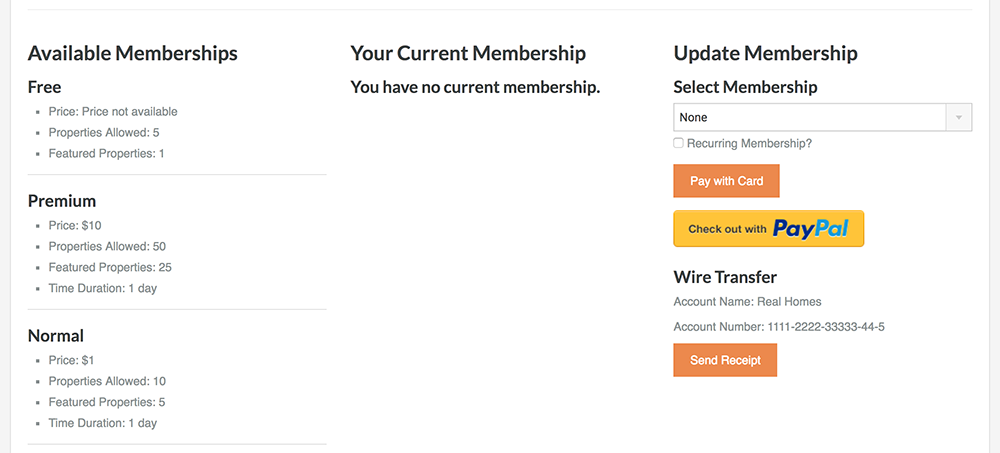
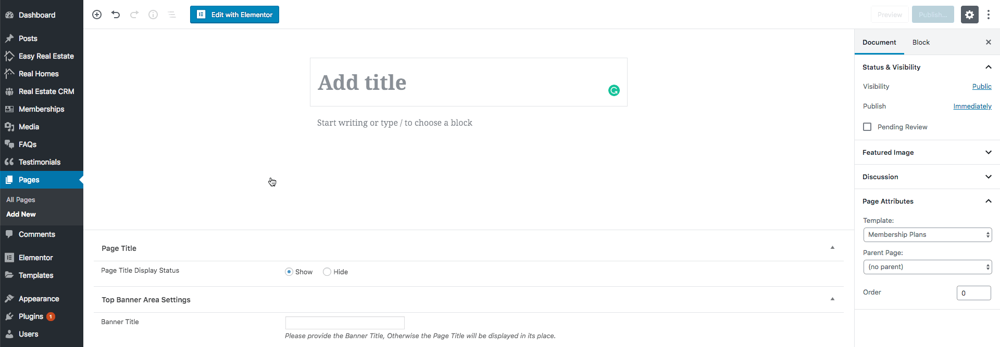
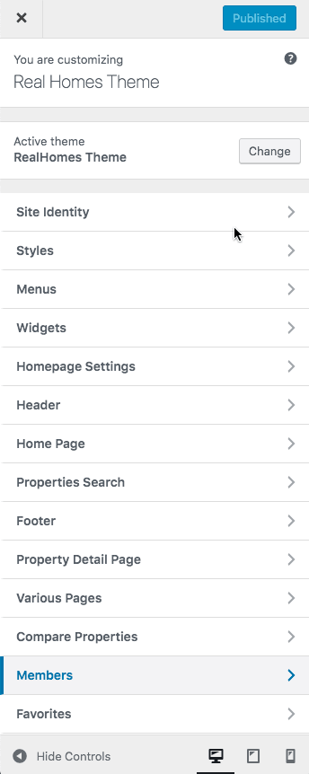

# Creating Membership Packages

To create membership packages, follow these instructions:

Go to **Dashboard → Memberships**

Click on **Add New Membership** button.

Fill the details related to membership and then click **Publish** button. 

If you are creating a recurring membership package through Stripe then paste the ID of that package in the **Stripe Subscription Plan ID** text field.

!!! note
    The price of a membership package cannot be changed after creating the package. If you want to change the price of the package then please create another one.

!!! warning "Important"
    Please note that once users start buying membership package, you cannot delete those packages. If you want to delete the package, then change the status of membership from **Publish** to **Pending**. You can change the status to "**Pending**" by clicking on Edit present after "Publish" status. Select Pending Review, then click OK and then Update button to update the status of membership.

### **User Membership View**

After creating membership packages, they will automatically start appearing on **Edit Profile** page.

The users can view, buy and control their packages from this page.

### **User Membership Page (Modern)**

If you are using **Modern Design** then you must create a new page with **Membership Plans Template** assigned to it.

After publishing the page, you can assign it in **Dashboard → Members → Basic** and select the page you created for **Select Membership Page** option.

