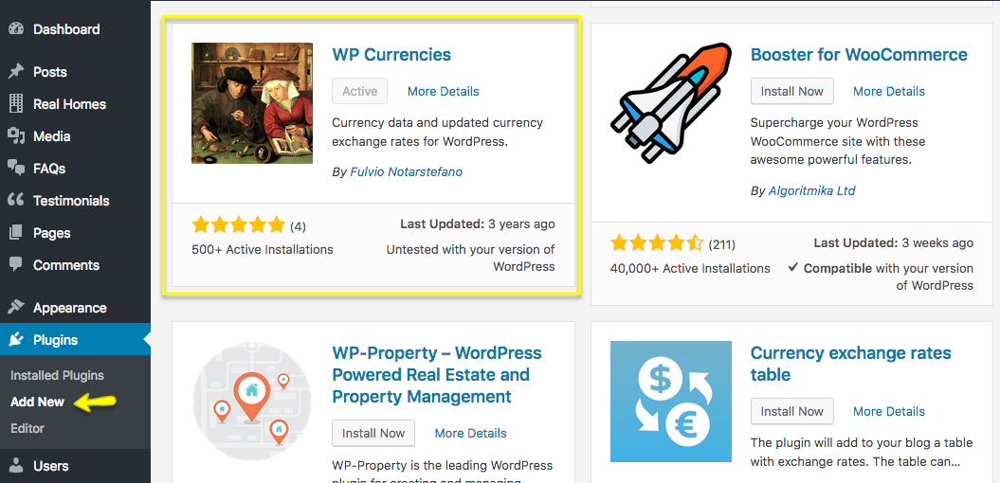
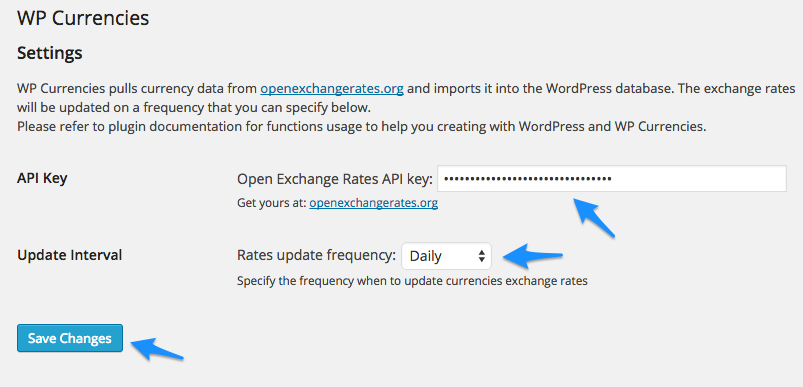
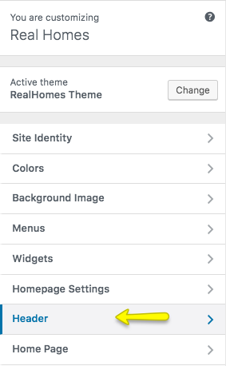
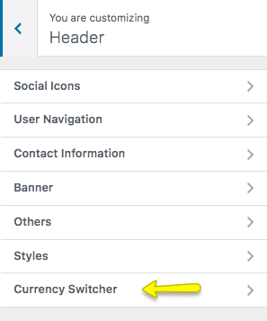
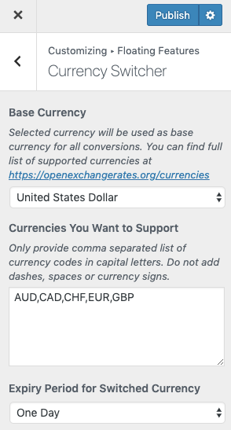

# How to set up Currency Switcher

> **Updated Note:**

> We recently learned from our experience that this feature is not stable yet and I would not recommend you to use it for now. Actually, it’s related API produce inconsistencies with currency conversion data while updating currency exchange rates. So, We are working on making it stable in future updates.

We will use [WP Currencies plugin](https://wordpress.org/plugins/wp-currencies/) to add currency switcher.

Install the [WP Currencies plugin](https://wordpress.org/plugins/wp-currencies/). As guided in screen shot below. 

After installing and activating the plugin. 

Go to **Dashboard → Settings → Currencies**. You need to sign up and get a free api key for your site from https://openexchangerates.org/signup/free. 

Provide the **API key** and save the changes. 

Now you need to navigate to **Dashboard → Real Homes → Customize Settings** and look for Header panel. This panel contains **Currency Switcher** section ( which only appears if related plugin is installed ) There you can configure related settings.

Configure base currency and target currencies.

> **NOTE:** 

> If you find base currency dropdown empty then simply wait for few minutes and refresh your settings page. As this could be due to the late completion of first time data fetch request from openexchangerates.org. In case of any problem reach us on our support site.

After making all the above settings, Visit your site's front end and you will have a currency switcher in your header. As displayed in screen shot below. 

Use it and you will find that prices are being displayed in your selected currency.
