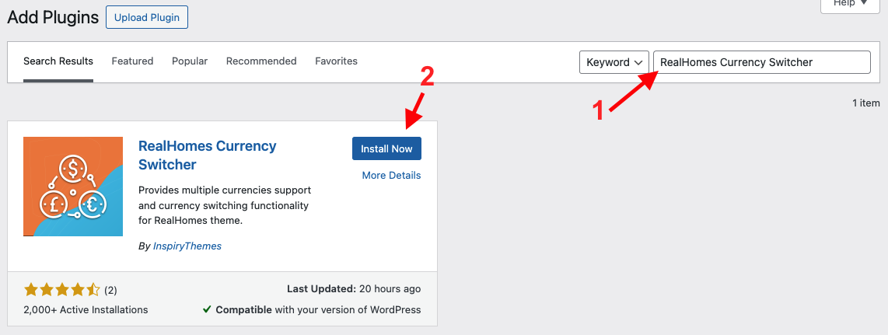
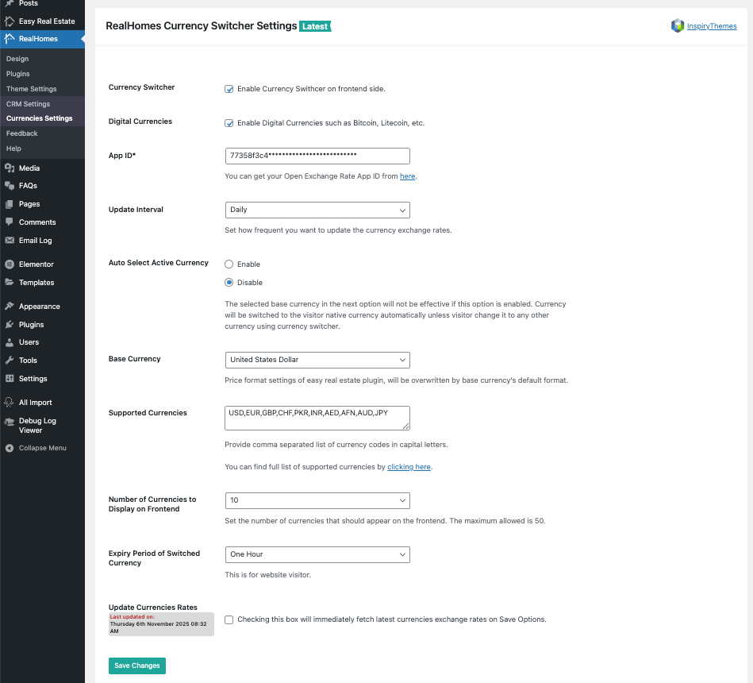
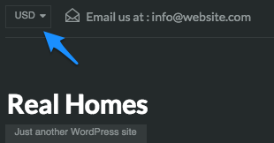

# 💱 How to Set Up the Currency Switcher

The **Currency Switcher** feature allows visitors to view property prices in their preferred currency. Powered by the [**RealHomes Currency Switcher**](https://wordpress.org/plugins/realhomes-currency-switcher/) plugin.

---

## 🔌 Step 1: Install & Activate the Plugin

1. Navigate to **Dashboard → Plugins → Add New**  
2. Search for **RealHomes Currency Switcher**
3. **Install** and **Activate** the plugin

---

## ⚙️ Step 2: Configure Currency Switcher Settings

After activation, navigate based on your version of the **RealHomes** theme:

=== "v4.5.1 and Later"

    !!! success "RealHomes Settings"
        Dashboard ➤ RealHomes ➤ Settings ➤ Currencies Settings

=== "v4.5.0 and Earlier"

    !!! info "Legacy Settings"
        Dashboard ➤ Easy Real Estate ➤ Currency Switcher

    

Here you'll find the configuration options:

- ✅ **Enable/Disable Currency Switcher**
- 🔐 **Open Exchange App ID**
- 🔄 **Update Interval** – Define how often exchange rates update
- 💲 **Base Currency** – Set your website's main currency
- 🌐 **Allowed Currencies** – Choose which currencies users can switch between
- 💹 **Number of Currencies to Display**
- ⏱️ **Expiry Period** – Session duration for selected currency
- 📥 **Update Currencies Rates** – Manually fetch latest rates

> 📘 You can also view the [complete list of supported currencies](https://docs.openexchangerates.org/reference/supported-currencies?ref=realhomes) by Open Exchange Rates for reference.

---

## 🌍 Step 3: View the Currency Switcher on the Frontend

After configuring, you’ll see a floating **Currency Switcher** on the right-hand side of your website.

---

## 🆘 Need Help?

🙋‍♂️ Still have questions?  
  [Log in or register](https://support.inspirythemes.com/login-register/) on our support platform and [submit your query](https://support.inspirythemes.com/ask-question/).