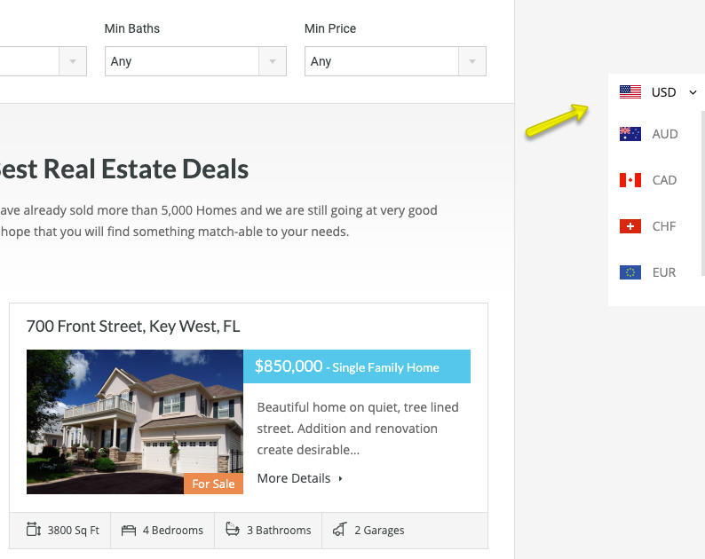

# How to set up Currency Switcher

To enable Currency Switching feature in RealHomes theme you would need to install and configure the [RealHomes Currency Switcher](https://wordpress.org/plugins/realhomes-currency-switcher/) plugin. Plesae follow the steps given blow.

We will use [WP Currencies plugin](https://wordpress.org/plugins/wp-currencies/) to add currency switcher. If you are unable to install it via Dashboard Plugin then you can directly download it from [here](https://github.com/unfulvio/wp-currencies/archive/1.4.6.zip).

Install the [WP Currencies plugin](https://wordpress.org/plugins/wp-currencies/). As guided in screen shot below. 

After installing and activating the plugin. 

Go to **Dashboard → Settings → Currencies**. You need to sign up and get a free api key for your site from https://openexchangerates.org/signup/free. 

Provide the **API key** and save the changes. 

Now you need to navigate to **Dashboard → Real Homes → Customize Settings → Floating Features** panel. This panel contains **Currency Switcher** section ( which only appears if related plugin is installed ) There you can configure related settings.

Configure base currency and target currencies.

!!! note
    If you find base currency dropdown empty then simply wait for few minutes and refresh your settings page. As this could be due to the late completion of first time data fetch request from openexchangerates.org. In case of any problem reach us on our support site.

After making all the above settings, Visit your site's front end and you will have a currency switcher floating on the right side of your site. As displayed in screenshot below.

Use it and you will find that prices are being displayed in your selected currency.
