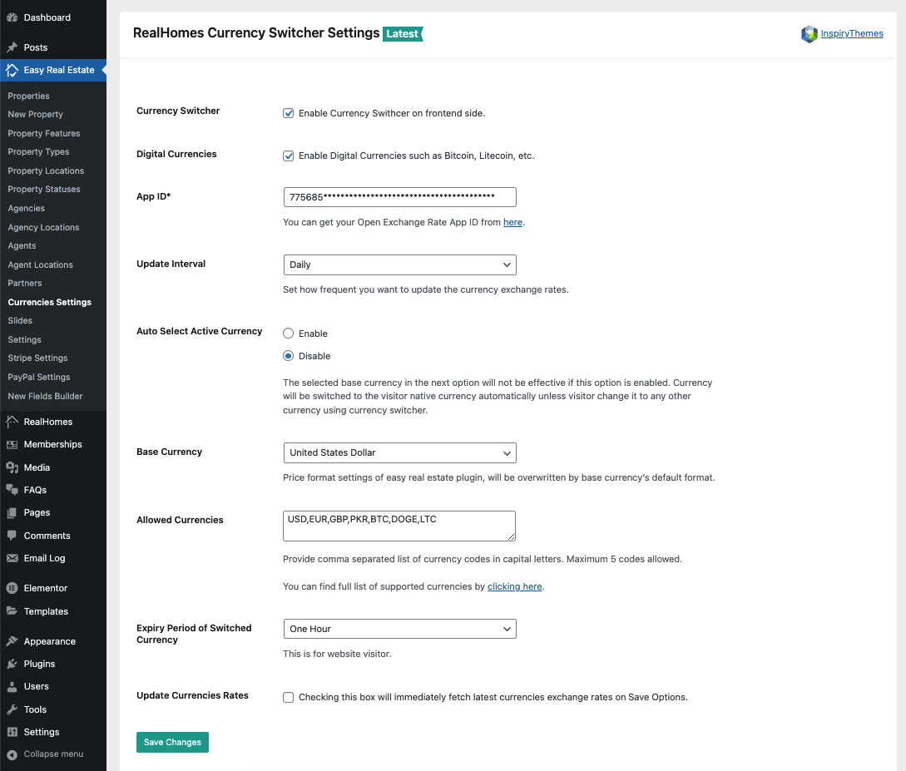

# How to set up Currency Switcher

To enable **Currency Switching** feature in RealHomes theme you would need to install and configure the **[RealHomes Currency Switcher](https://wordpress.org/plugins/realhomes-currency-switcher/)** plugin. Plesae follow the steps given blow.k

## Install & Activate 'RealHomes Currency Switcher' Plugin

1. Navigate to **Dashboard → Plugins → Add New** and search for **RealHomes Currency Switcher** as displayed in the screenshot below: 
	
	

2. Once found, **Install** and **Activate** the plugin.

## Configure Plugin Settings

Navigate to **Dashboard → Easy Real Estate → Currencies Settings** page. This page contains the following settings.
	
- Enable/Disable Currency Switcher
- Open Exchange App ID (*You can get your Open Exchange Rate 'App ID' from <a href="https://support.openexchangerates.org/article/121-your-app-id" target="_blank">here</a>)
- Update Interval
- Base Currency
- Allowed Currencies
- Expiry Period of Switched Currency
- Update Currencies Rates

Once you are done with the above settings, visit your site's frontend and you will see a currency switcher floating at the right side of your site. As displayed in screenshot below.

!!!note
	In case of any further assistance, you can signup/login to our **[support website](https://support.inspirythemes.com/login-register/)** and **[ask your question](https://support.inspirythemes.com/ask-question/)** over there.