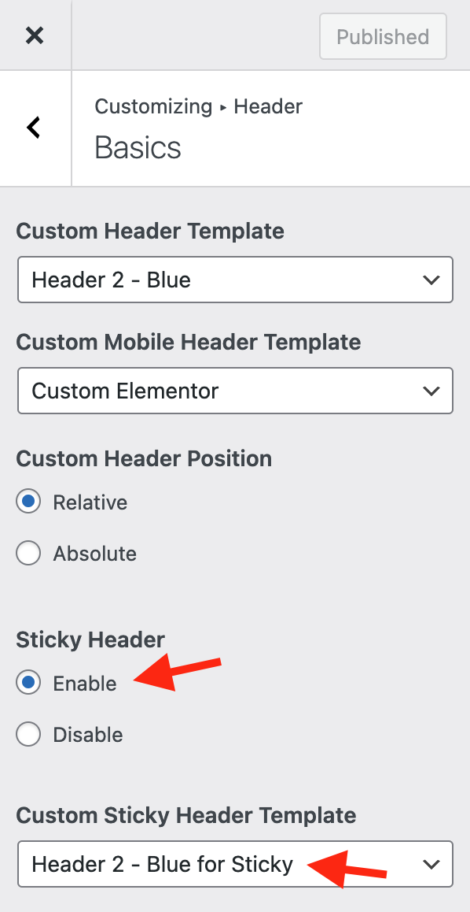

# Custom Header & Footer with Elementor

### **How to Create Custom Header and Footer in RealHomes using Elementor?**

Since v3.18.0, you can create your own custom headers and footers for you website using the free version of Elementor.

<iframe width="100%" height="525" src="https://www.youtube.com/embed/kYXU9I69SNY" title="YouTube video player" frameborder="0" allow="accelerometer; autoplay; clipboard-write; encrypted-media; gyroscope; picture-in-picture" allowfullscreen></iframe>

### **How to make Elementor Header Sticky?**

First, please make a copy of your existing Custom Elementor Header, and make any necessary changes to as per your liking. It is very important to note here that **you can't use the same header as sticky**, otherwise you will experience style and layout related issues

Once you have made satisfactory changes, navigate to <strong>Dashboard → Real Homes → Customize Settings → Header</strong> and Enable the settings "**Sticky Header**" and select the **Sticky Header** you have just created.

### **How to import Custom Headers & Footers?**

The custom headers and footers JSON files are located in the theme package [ **rh-main-package.zip** ]. Upon extraction, you can find them at the **rh-main-package → Elementor Templates**, and in this directory, you can check **Headers** and **Footers** folder.

Follow the steps below to import.

1. Navigate to **Dashboard → Templates → Saved Templates**.
2. Click on **Import Templates** and then select any JSON file for the Header or Footer to import.
3. Once the Elementor template is imported, edit the home page or the relevant page with Elementor and follow this <a href="https://jumpshare.com/v/56g9U1ajB0UNF0uShdLt">quick video demonstration</a>.