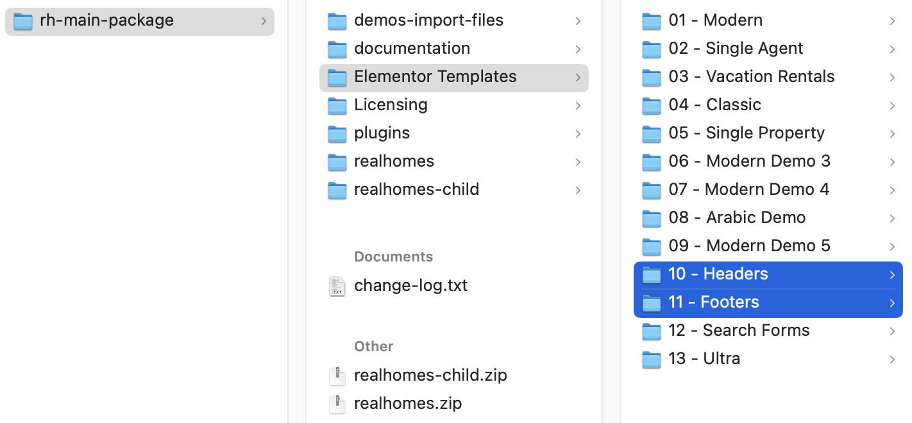

# Custom Header & Footer with Elementor

### **How to Create Custom Header and Footer in RealHomes using Elementor?**

Since v3.18.0, you can create your own custom headers and footers for you website using the free version of Elementor.

<iframe width="100%" height="525" src="https://www.youtube.com/embed/kYXU9I69SNY" title="YouTube video player" frameborder="0" allow="accelerometer; autoplay; clipboard-write; encrypted-media; gyroscope; picture-in-picture" allowfullscreen></iframe>

### **How to import Custom Headers & Footers?**

The custom headers and footers JSON files are located in the theme package [ **rh-main-package.zip** ]. Upon extraction, you can find them at the **rh-main-package → Elementor Templates**, and in this directory, you can check Headers and Footers folders.

