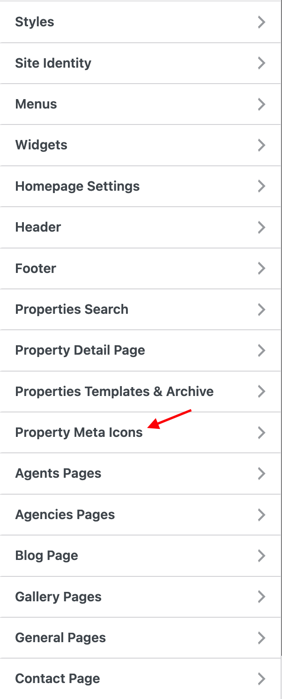
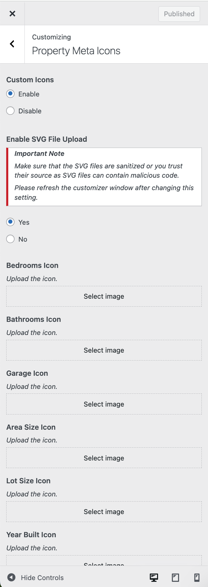
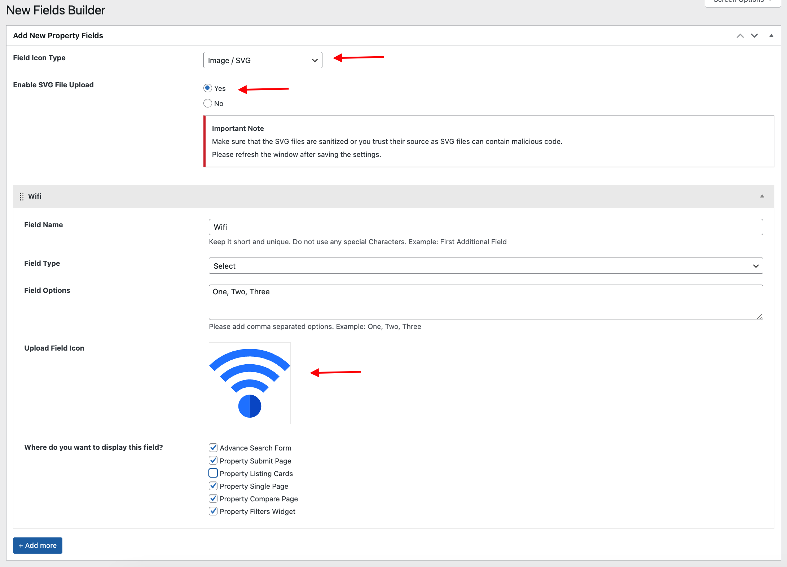

# Custom Meta Icons

### **Meta Icons for Existing Meta Fields**

You can upload and set your own custom icons for meta fields. Please navigate to **Dashboard → Appearance → Customize Settings → Property Meta Icons**.

{ width="300" }
{ width="300" }

### **Meta Icons for New Fields**

You can also assign your own custom icons for any meta fields created by Field Builder. So, you can see the meta icon option in Field Builder at **Dashboard → Easy Real Estate → New Field Builder**.

