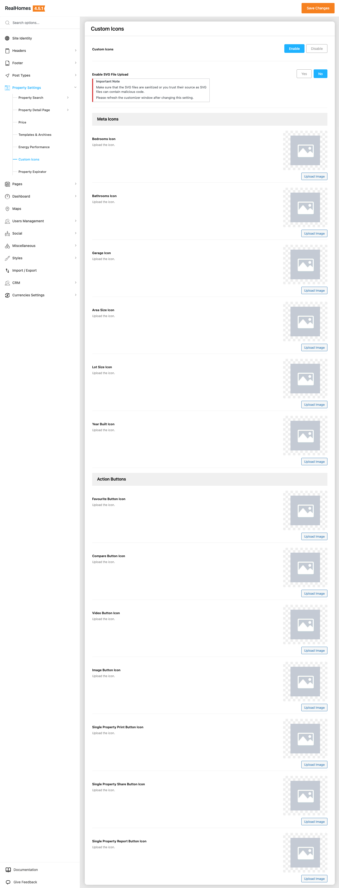
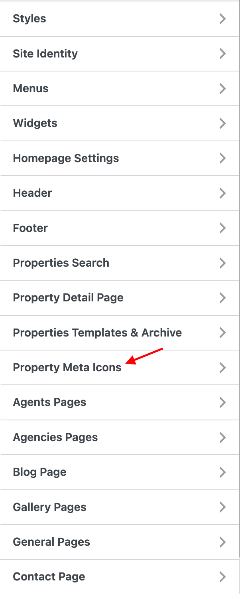
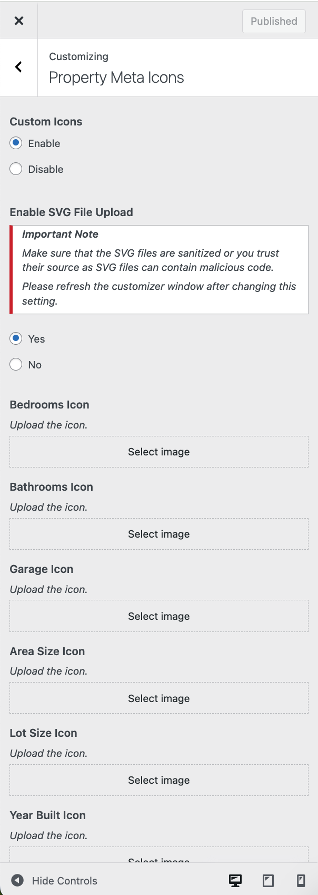
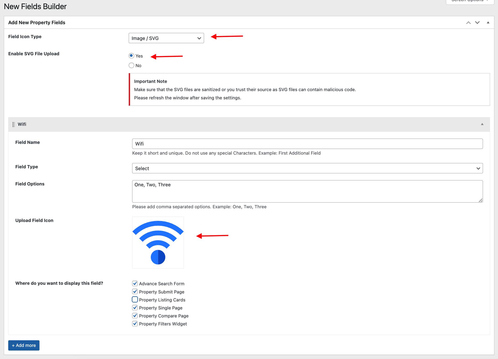

# Custom Meta Icons

You can upload and set your own custom icons for meta fields. Follow the path below based on your theme version:

---

#### **v4.5.1 and Later**

!!! info "Navigation Path"
    **Dashboard** → **RealHomes** → **Settings** → **Miscellaneous** → **Custom Icons** (tab)

---

#### **v4.5.0 and Earlier**

!!! info "Navigation Path"
    **Dashboard** → **Appearance** → **Customize Settings** → **Property Meta Icons**

{ width="300" }
{ width="300" }

---

### **Meta Icons for New Fields**

You can also assign your own custom icons for any meta fields created by **Field Builder**. Navigation path for **Field Builder**:

*   **v4.5.1+**: **Dashboard → RealHomes → Settings → Field Builder**
*   **v4.5.0-**: **Dashboard → Easy Real Estate → Settings → New Field Builder**

