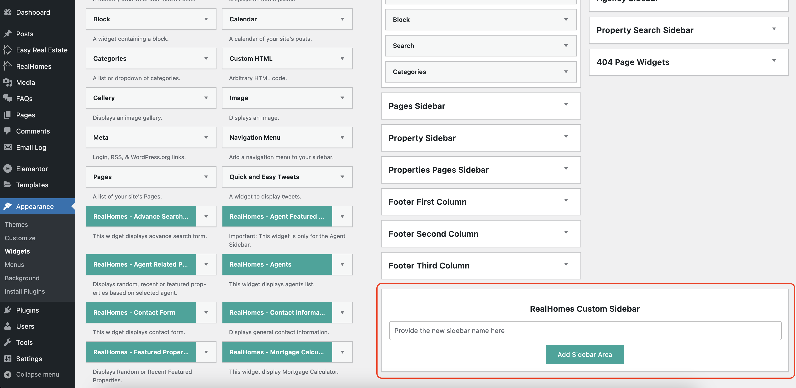
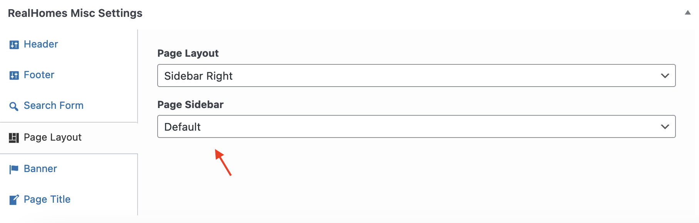

# **Custom Sidebars**

### **Create a Custom Sidebar**

In v4.2.0, we introduced Custom Sidebars feature which allows you to create custom sidebars to use throughout the pages of your website.

You can create multiple custom sidebars in **Dashboard → Appearance → Widgets**.

### **Assign a Sidebar**

You can assign a custom sidebar while adding/editing the page in Page Layout settings as per the following screenshot.

