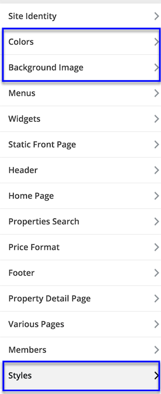
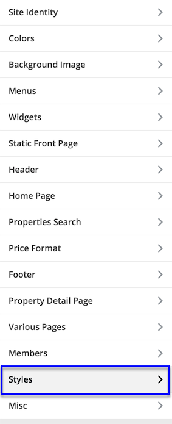
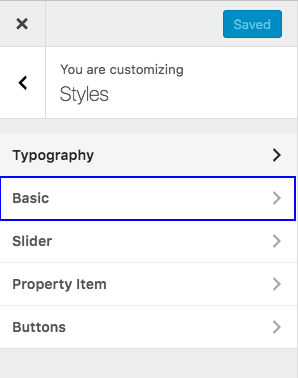
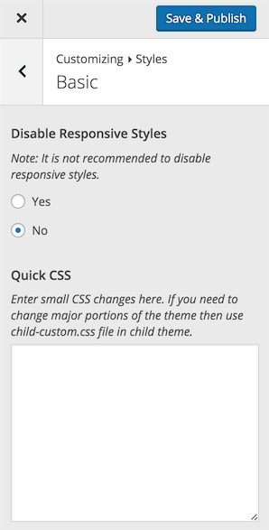
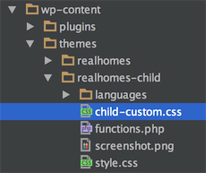
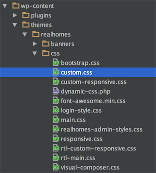

# How to Modify Styles

There are various options available to modify styles in this theme.

**Styles Settings** - Go to **Dashboard → Appearance → Customize** for various styles related sections. 

**Some common styles options.**

**Header Styles** 

**Footer Styles** 

**Quick CSS** - Go to **Dashboard → Appearance → Customize** and navigate to **Styles → Basic** to add any quick css. 

**Custom CSS in Child Theme** - '**child-custom.css**' file is provided in child theme to add major css changes. 

> Note: It is highly recommended to use child theme for any changes that you want to make as this way you can update parent theme whenever an update becomes available. Simply copy a template file that you want to change to child theme after creating same directory structure and then modify it. For more info http://codex.wordpress.org/Child_Themes.

**Custom CSS in Parent Theme** - if you are not using child theme then '**css/custom.css**' file is provided in parent theme to add major css changes. 

### Use Child Theme for Customization ( Highly Recommended )

> It is highly recommended to use child theme for any customization that you want to make, So that you can easily update parent theme whenever a new update becomes available. A pre-built ready to use child theme is included in the main theme pack that you have downloaded from themeforest.

