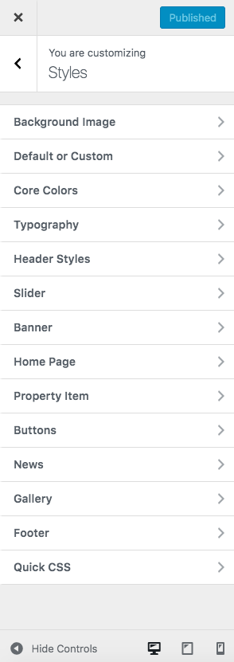
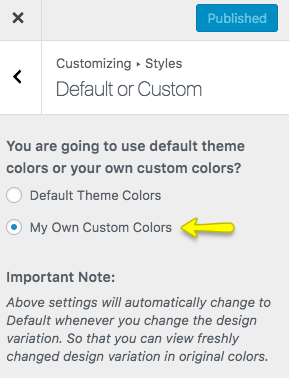

# How to Modify Styles

There are various options available to modify styles in Real Homes Theme. These options gives you control over default colors as well as styles throughout the theme.

## Styles Settings

Go to **Dashboard → Real Homes → Customize Settings → Styles** for all styles related options.

 

## Override Default Styles

Make sure that you have selected **My Own Custom Colors** in **Dashboard → Real Homes → Customize Settings → Styles → Default or Custom** section to override the default styles and colors of the design.

## Quick CSS

**Quick CSS** - Go to **Dashboard → Real Homes → Customize Settings** and navigate to **Styles → Basic** to add any quick css. 

## Custom CSS in Child Theme

**Custom CSS in Child Theme** - '**child-custom.css**' file is provided in child theme to add major css changes. 

!!! note
    It is highly recommended to use child theme for any changes that you want to make as this way you can update parent theme whenever an update becomes available. Simply copy a template file that you want to change to child theme after creating same directory structure and then modify it. For more info http://codex.wordpress.org/Child_Themes.

## Custom CSS in Parent Theme

**Custom CSS in Parent Theme** - if you are not using child theme then '**css/custom.css**' file is provided in parent theme to add major css changes. 

## Use Child Theme for Customization ( Highly Recommended )

> It is highly recommended to use child theme for any customization that you want to make, So that you can easily update parent theme whenever a new update becomes available. A pre-built ready to use child theme is included in the main theme pack that you have downloaded from themeforest.

