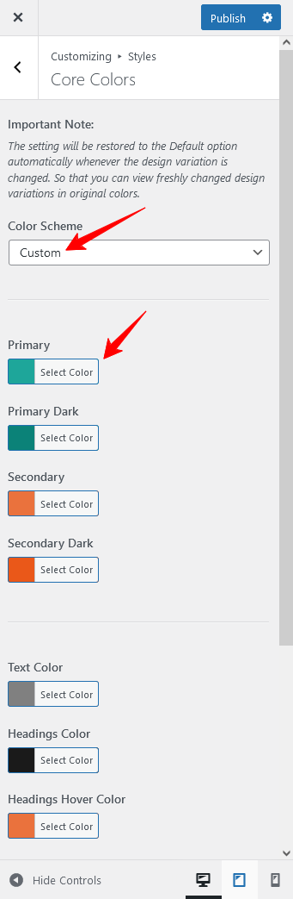

# How to Modify Styles

There are various options available to modify styles in RealHomes Theme. These options gives you control over default colors as well as styles throughout the theme.

## Core Color Settings

Go to **Dashboard → Real Homes → Customize Settings → Styles → Core Colors** and select **Custom** from **Color Scheme** drop-down list.

 

## Override Styles (in Previous Versions)

Make sure that you have selected **My Own Custom Colors** in **Dashboard → Real Homes → Customize Settings → Styles → Default or Custom** section to override the default styles and colors of the design.

<iframe width="688" height="387" src="https://www.youtube.com/embed/qjAgcc2R09k" frameborder="0" allow="accelerometer; autoplay; encrypted-media; gyroscope; picture-in-picture" allowfullscreen></iframe>