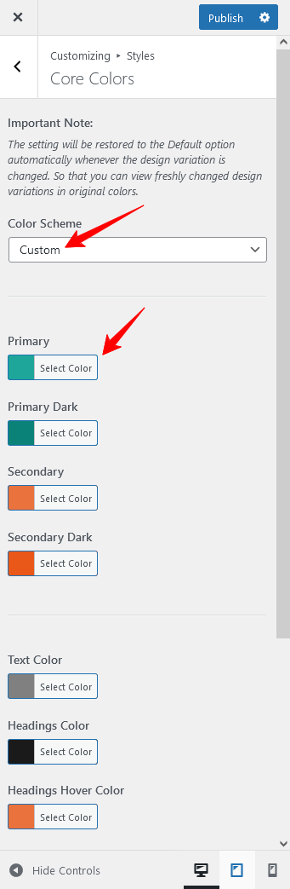
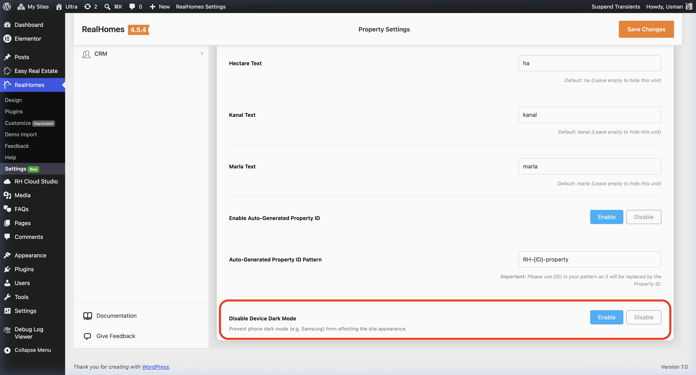

# How to Modify Styles

There are various options available to modify styles in RealHomes Theme. These options gives you control over default colors as well as styles throughout the theme.

## Core Color Settings

Go to **Dashboard → RealHomes → Customize Settings → Styles → Core Colors** and select **Custom** from **Color Scheme** drop-down list.

 

## Dark Mode Prevention

As of version **4.5.4**, if you want to ensure your website retains its intended color scheme regardless of the user's device settings, you can enable the **Dark Mode Prevention** setting. This feature prevents smaller devices (like mobile phones) from automatically forcing the website into a dark color scheme.

Navigate to **Dashboard → RealHomes → Settings → Property Settings** and scroll to the bottom to find and toggle this setting.

## Override Styles (in Previous Versions)

Make sure that you have selected **My Own Custom Colors** in **Dashboard → RealHomes → Customize Settings → Styles → Default or Custom** section to override the default styles and colors of the design.

<iframe width="688" height="387" src="https://www.youtube.com/embed/qjAgcc2R09k" frameborder="0" allow="accelerometer; autoplay; encrypted-media; gyroscope; picture-in-picture" allowfullscreen></iframe>