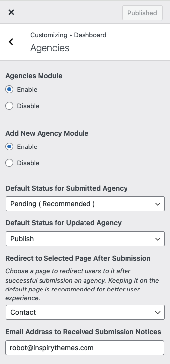

# Dashboard Agencies Module
 
You can Enable/Disable **Agencies** module on dashboard by navigating to **Dashboard → RealHomes → Customize Settings → Dashboard → Agencies** section.

In this module, you can control the following settings.

- **Add New Agency Module** ( Enable/Disable add new agency module )
- **Default Status for Submitted Agency** ( Choose 'Pending' or 'Publish' for newly submitted agencies )
- **Default Status for Updated Agency** ( Customize default status for updated agencies )
- **Redirect to Selected Page After Submission** ( Select the page for successful submission redirection )
- **Email Address to Received Submission Notices** ( Receive notifications at specified email for new agencies submissions )

