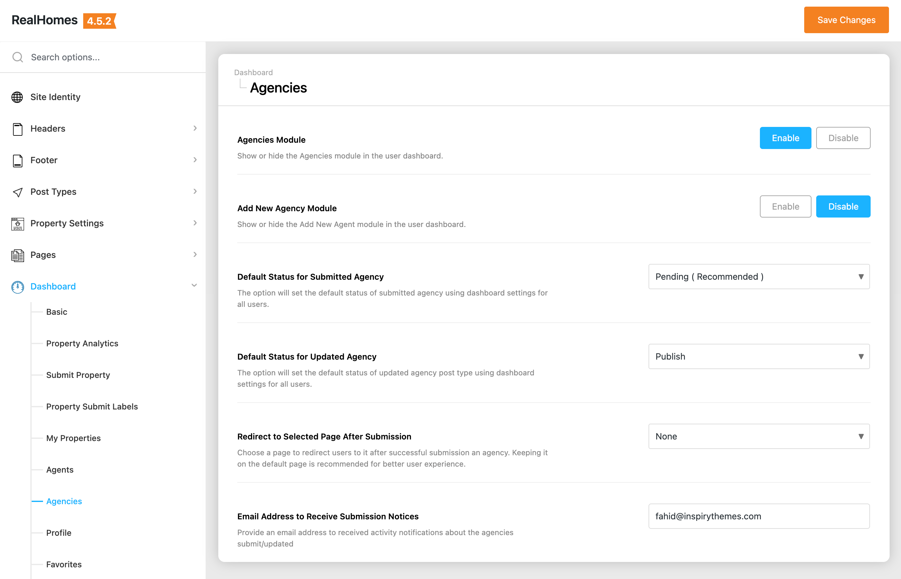
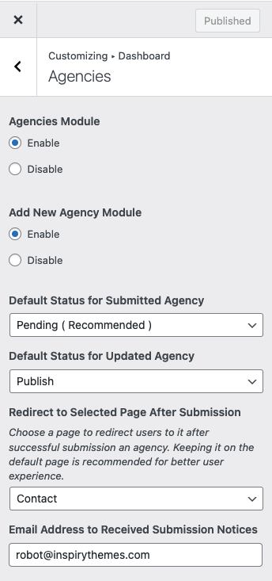

# Dashboard Agencies Module
 
You can Enable/Disable **Agencies** module on dashboard by navigating based on your version of the **RealHomes** theme:

=== "v4.5.1 and Later"

    !!! success "RealHomes Settings"
        Dashboard ➤ RealHomes ➤ Settings ➤ Dashboard ➤ Agencies

    

=== "v4.5.0 and Earlier"

    !!! info "Legacy Settings"
        Dashboard ➤ RealHomes ➤ Customize Settings ➤ Dashboard ➤ Agencies

    

In this module, you can control the following settings.

- **Add New Agency Module** ( Enable/Disable add new agency module )
- **Default Status for Submitted Agency** ( Choose 'Pending' or 'Publish' for newly submitted agencies )
- **Default Status for Updated Agency** ( Customize default status for updated agencies )
- **Redirect to Selected Page After Submission** ( Select the page for successful submission redirection )
- **Email Address to Received Submission Notices** ( Receive notifications at specified email for new agencies submissions )

---

### **Managing Agents' Properties as an Agency**

As of version **4.5.4**, users with the **Agency** role can log into the frontend dashboard and seamlessly manage properties submitted by their associated agents. This dedicated dashboard section allows agency administrators to oversee, edit, and publish their team's real estate listings directly from the frontend interface.