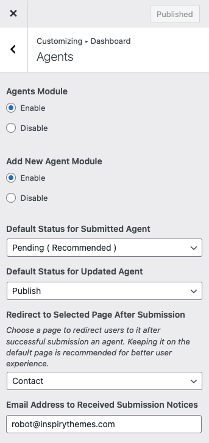

# Dashboard Agents Module
 
You can Enable/Disable **Agents** module on dashboard by navigating to **Dashboard → RealHomes → Customize Settings → Dashboard → Agents** section.

In this module, you can control the following settings.

- **Add New Agent Module** ( Enable/Disable add new agent module )
- **Default Status for Submitted Agent** ( Choose 'Pending' or 'Publish' for newly submitted agents )
- **Default Status for Updated Agent** ( Customize default status for updated agents )
- **Redirect to Selected Page After Submission** ( Select the page for successful submission redirection )
- **Email Address to Received Submission Notices** ( Receive notifications at specified email for new agent submissions )

