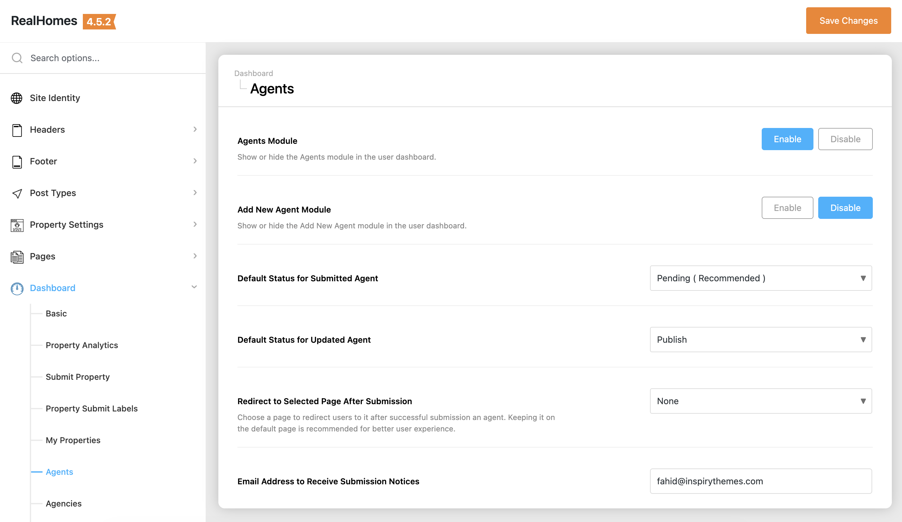
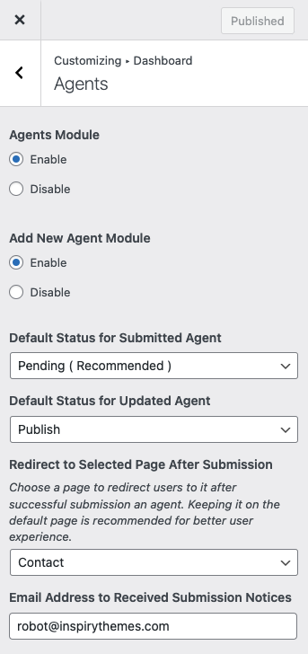

# Dashboard Agents Module
 
You can Enable/Disable **Agents** module on dashboard by navigating based on your version of the **RealHomes** theme:

=== "v4.5.1 and Later"

    !!! success "RealHomes Settings"
        Dashboard ➤ RealHomes ➤ Settings ➤ Dashboard ➤ Agents

    

=== "v4.5.0 and Earlier"

    !!! info "Legacy Settings"
        Dashboard ➤ RealHomes ➤ Customize Settings ➤ Dashboard ➤ Agents

    

In this module, you can control the following settings.

- **Add New Agent Module** ( Enable/Disable add new agent module )
- **Default Status for Submitted Agent** ( Choose 'Pending' or 'Publish' for newly submitted agents )
- **Default Status for Updated Agent** ( Customize default status for updated agents )
- **Redirect to Selected Page After Submission** ( Select the page for successful submission redirection )
- **Email Address to Received Submission Notices** ( Receive notifications at specified email for new agent submissions )