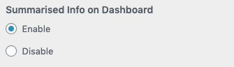
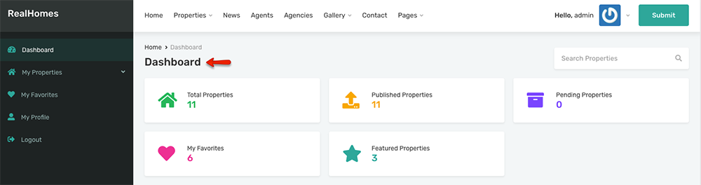
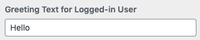
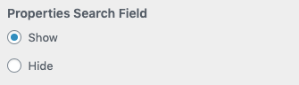
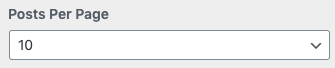
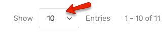

Navigate to **Dashboard → RealHomes → Customize Settings → Dashboard → Basic** section to configure the following settings.

## Summarised Info Module

You can enable/disable **Summarised info Module on Dashboard** using following setting. 

## Greeting Text

Customize **Greeting Text for Logged-in Users** using this setting. 

## Properties Search Field

Show/Hide **Properties Search Field** using this setting. 

## Posts Per Page

Set the default number of posts value for dashboard posts list pages using this setting. 

