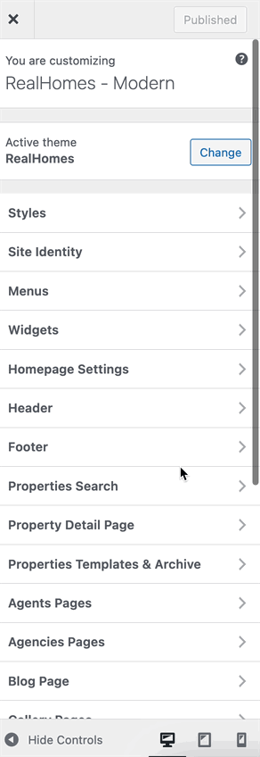

# Dashboard Labels

In order to change the Dashboard Menu labels kindly navigate to **Dashboard → RealHomes → Customize Settings → Dashboard → Dashboard Menu Custom Labels** section. In this section, you can modify both page and menu titles for each section of the frontend user dashboard.

