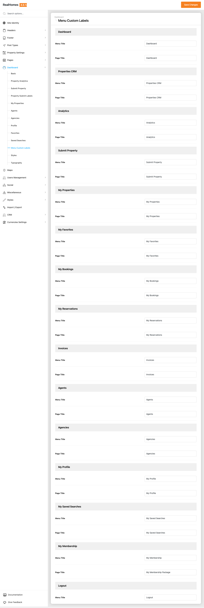
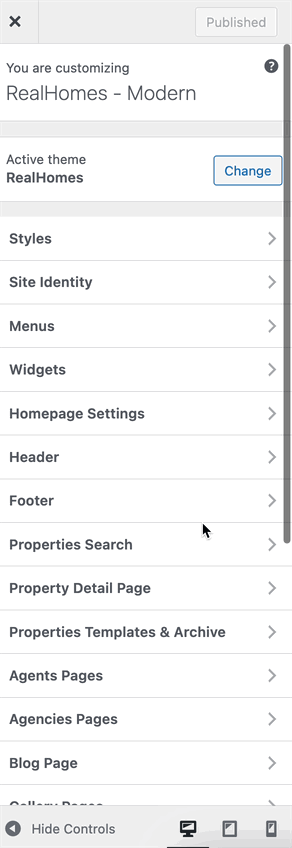

# Dashboard Labels

In order to change the Dashboard Menu labels, navigate based on your version of the **RealHomes** theme:

=== "v4.5.1 and Later"

    !!! success "RealHomes Settings"
        Dashboard ➤ RealHomes ➤ Settings ➤ Dashboard ➤ Menu Labels

    

=== "v4.5.0 and Earlier"

    !!! info "Legacy Settings"
        Dashboard ➤ RealHomes ➤ Customize Settings ➤ Dashboard ➤ Dashboard Menu Custom Labels

    

In this section, you can modify both page and menu titles for each section of the frontend user dashboard.